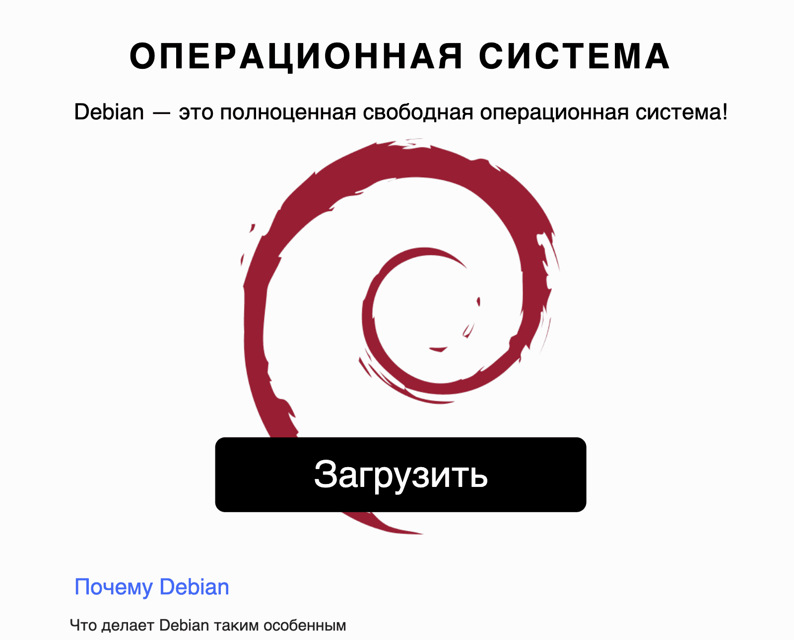
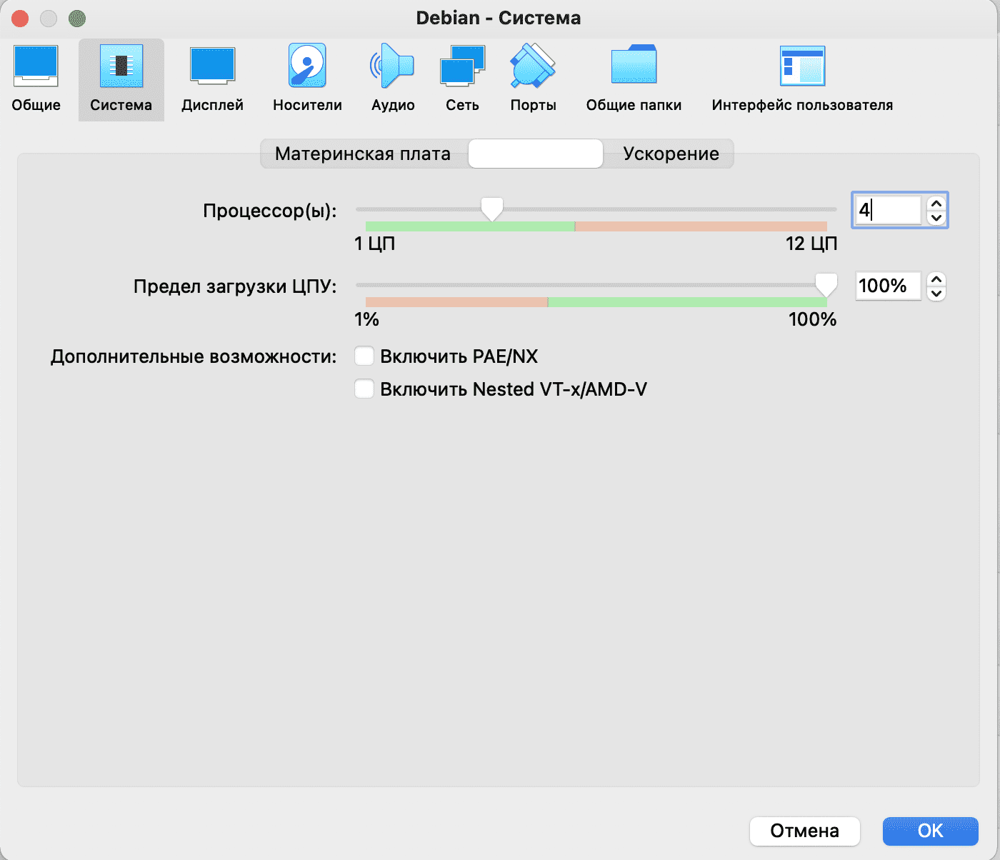
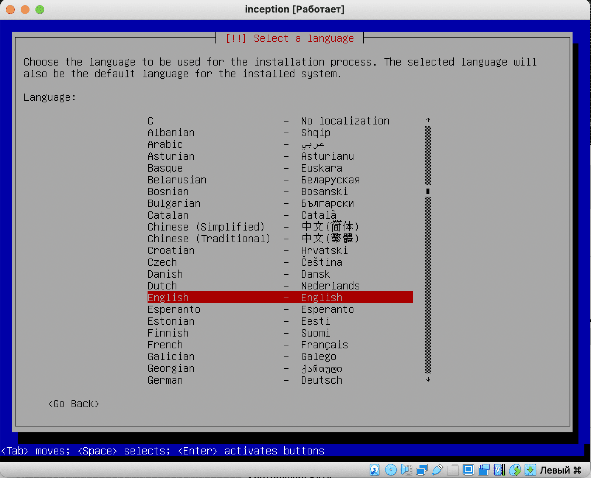
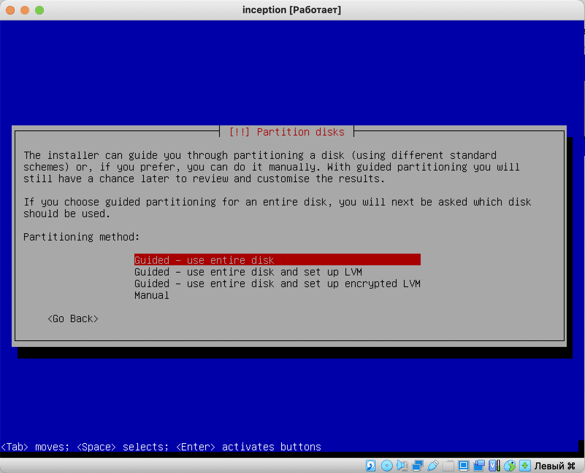
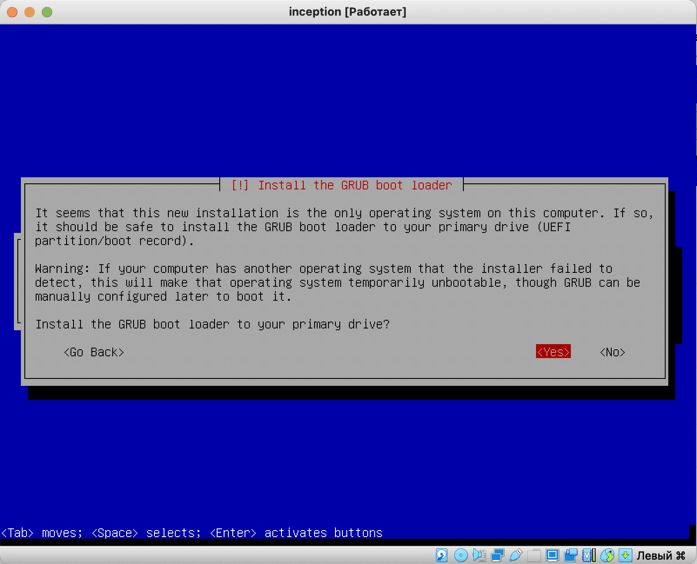
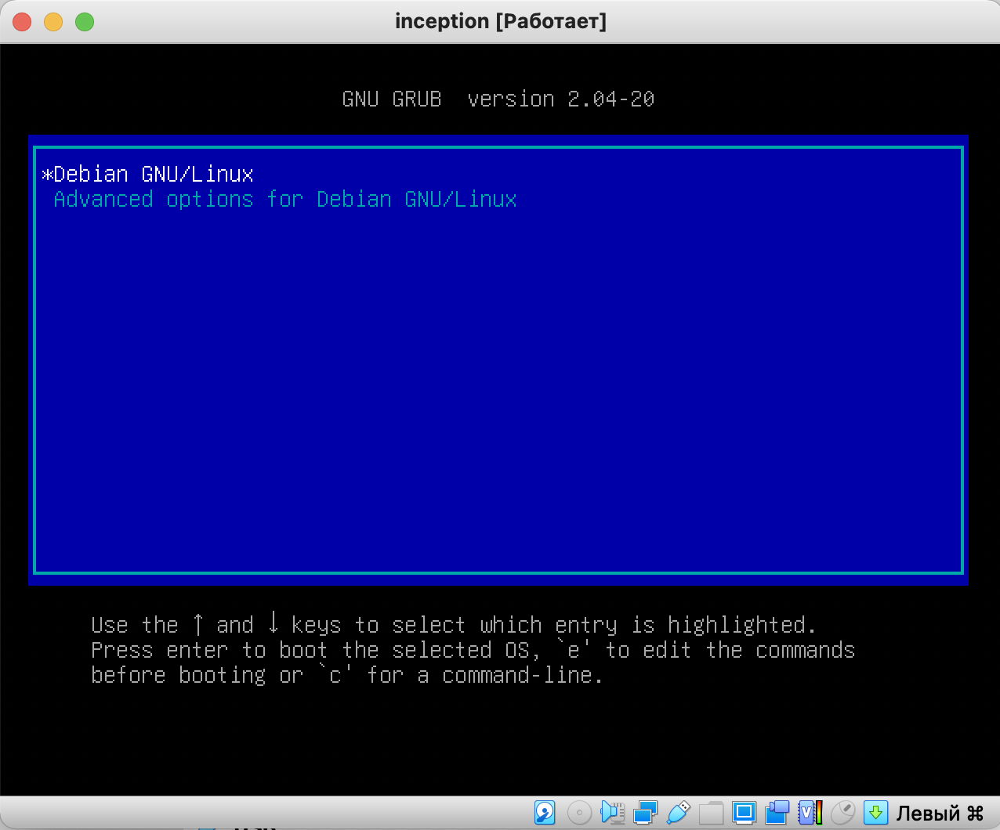

# Установка Debian Linux в Virtualbox

## Шаг 1. Скачивание

Заходим на сайт ```https://www.debian.org/``` и скачиваем веб-инсталлер



## Шаг 2. Запуск

### 2.1 Создание виртуальной машины

Создаём виртуальную машину. Называем как-либо наш проект (я назвал просто Debian) и выставляем правильную конфигурацию системы. Если проект делается на школьном mac, его папку нужно размещать в goinfre:


### 2.2 Выделение ресурсов

Оперативной памяти под проект можно выделить от 512 МБ если на ПК 4-8 ГБ до 4096 МБ если на ПК от 16 и выше. Больше 4 ГБ памяти на данный проект выделять бессмысленно.


 Формат выбираем VDI или VHD:


Выбираем динамический формат и выделяем под диск 8 гигабайт


Так же не забудьте выставить удобное разрешение экрана (коэффициент масштабирования), если работаете на mac.

 На mac обычно нормально 200% или 300%:


### 2.3 Выделение ресурсов процессора

Так же можно добавить системе ещё ядер. Больше четырёх добавлять избыточно:



## Шаг 3. Установка

### 3.1 Начало установки

После всех настроек запускаем наш проект. При старте нас встречает меню установки. Я выбираю обычный инсталлер, но при желании можно использовать и графический, это дело вкуса.


### 3.2 Выбор языка и локации

Мы можем выбрать американский английский (другие языки на проекте попросту не понадобятся), а в качестве локации указать Россию:




А в качестве базовой локали оставляем английский:


### 3.3 Настройка хоста и пользователей

Далее система предложит выбрать имя хоста. Можно назвать хост inception, однако я оставил дефолтное имя ```debian```:


Доменное имя пропускаем, оставив строку пустой.

Система предложит нам задать имя суперпользователя (root). Я назначаю руту простой пароль - цифру ```2```.

Далее нам предложат назвать как-то и обычного пользователя. Я ввожу свой ник в интре:


Принимаю это же имя в качестве имени аккаунта и ввожу простой пароль - единицу

### 3.4 Настройка временных зон

Выбираем свой часовой пояс.


### 3.5 Разметка диска

Далее запустится программа разметки. Нам не обязательно вдаваться в подробности файловой системы линукса, потому выбираем ```use entire disk``` - использовать весь диск.



Выбираем единственный доступный нам виртуальный диск:


Выбираем хранить все файлы в одном разделе:


И даём команду завершить разметку и записать изменения на диск:


Подтверждаем серьёзность наших намерений:


### 3.6 Установка базовой системы


После разметки запустится установка базовой системы. Далее я опишу только те шаги, которые важны нам, остальные действия можно будет пропустить нажав ```enter```

Всю лишнюю шелуху вроде дополнительного CD-образа, выбора зеркал репозиториев или опроса популярности пакетов просто пропускаем.

### 3.6.1 Выбор ПО

Нам нужен только ssh-сервер, потому пробелом убираем галочки со всего остального. В качестве графического окружения мы установим позже более лёгкий openbox - он нам будет нужен лишь для того, чтобы открыть наш сайт. Системные утиллиты нам так же не нужны.


### 3.6.1 Выбор ПО

В конце концов система наконец скажет нам что хочет установить системный загрузчик в главный раздел:



Выбираем раздел (он у нас один):


И установка завершиться:


Принимаем предложение закончить установку:


## Шаг 4 Загрузка и установка ПО

После перезагрузки нам предложат выбрать нашу систему:



Загрузимся под суперпользователем:


### 4.1 Установка необходимого софта

Обновим репозитории командой ```apt update```:


После этого установим нужные нам приложения командой ```apt install -y sudo ufw docker docker-compose openbox firefox```
