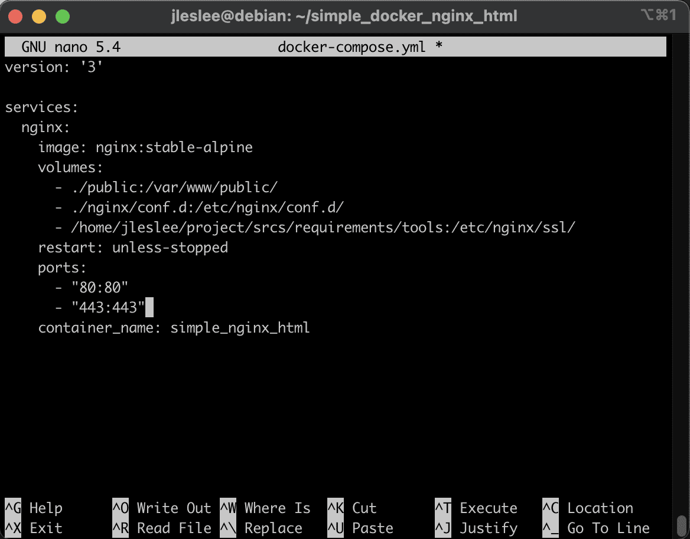
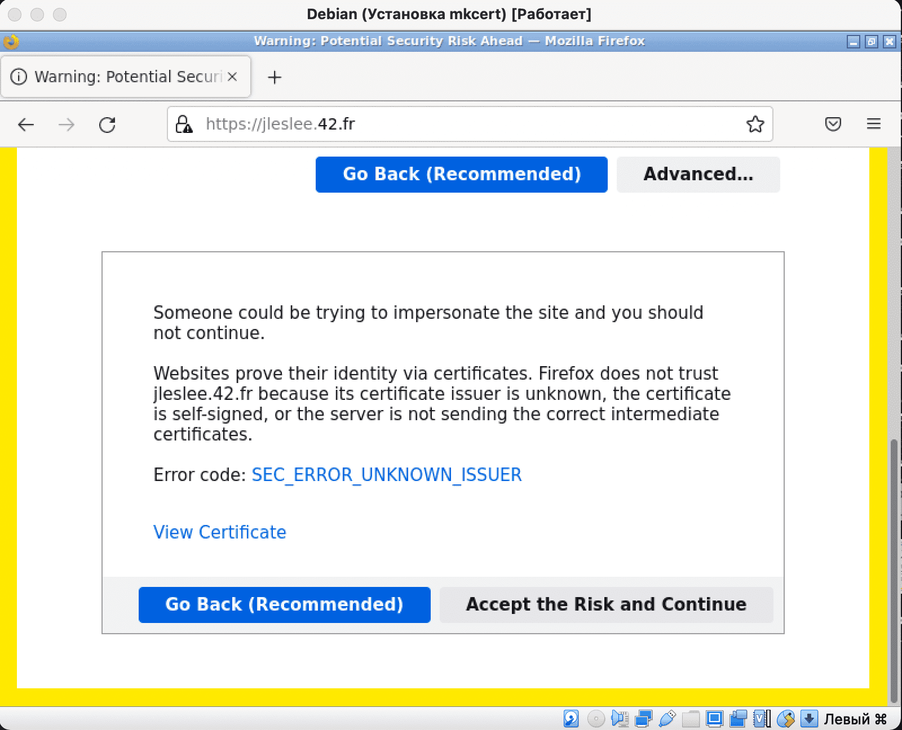
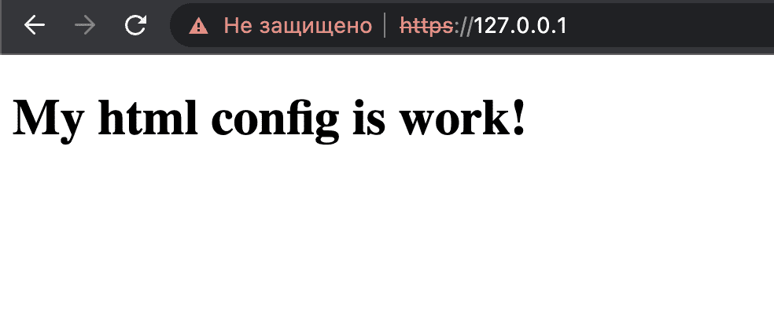

# Смена локального домена и установка сертификатов

## Шаг 1. Установка mkcert

По заданию нам необходимо установить сампоподписной ssl-сертификат и работать на порту 443, а так же изменить имя нашего домена на username.42.fr. Начнём с сампоподписного сертификата.

Для подписи нашего сертификата нам потребуется утиллита mkcert.

Логинимся по ssh под нашим обычным пользователем и выполняем следующие команды:

Обновляем список репозиториев:

```sudo apt update -y```

Устанавливаем утиллиты, которые помогут нам загрузить mkcert:

```sudo apt install wget curl libnss3-tools```

Загружаем бинарник mkcert:

```curl -s https://api.github.com/repos/FiloSottile/mkcert/releases/latest| grep browser_download_url  | grep linux-amd64 | cut -d '"' -f 4 | wget -qi -```

Переименовываем загруженный файл:

```mv mkcert-v*-linux-amd64 mkcert```

Разрешаем всем пользователям исполнение файла:

```chmod a+x mkcert```

И наконец перемещаем mkcert в рабочую директорию:

```sudo mv mkcert /usr/local/bin/```

Проверяем, что всё работает, запросив версию mkcert:

```mkcert --version```

Видим следующий вывод:


## Шаг 2. Смена локального домена

Далее нам необходимо сменить алиас нашего локального домена (127.0.0.1) на нужный нам nickname.42.fr. Открываем файл /etc/hosts:

```sudo nano /etc/hosts```

И добавляем к ```localhost``` наш ник.42.fr, в моём случае это ```jleslee.42.fr``` (порядок не важен):


Для проверки работы домена мы можем снова запустить наш тестовый контейнер:

```cd ~/simple_docker_nginx_html/ && docker-compose up -d```

Теперь не выходя из текущей терминальной сессии переключаемся в окно виртуальной машины с нашим запущенным локальным сервером. Логинимся там под обычным пользователем и выполняем

```sudo startx```

для запуска openbox. Включив веб-браузер, вбиваем туда адрес http://jleslee.42.fr/ заменив jleslee на свой ник. Результат должен быть следующим:


Как мы видим, локальный домен у нас есть, а вот сертификат отсутствует.

## Шаг 3. Получение сертификата

Свернём нашу графическую оболочку и снова откроем териминал. Теперь нам предстоит получить наш самоподписной сертификат.

Положим сертификат и ключ в папку project/srcs/requirements/tools/ (не зря же по заданию нам дана эта папка). Для начала перейдём туда:

```cd ~/project/srcs/requirements/tools/```

Для получения сертификата мы испольузем наш mkcert. Вот так я сгенерирую сертификат для своего домен jleslee.42.fr: 

```mkcert jleslee.42.fr```

Получилось следующее:


Как видим, наш сертификат действует более двух лет, и это хорошо.

Единственное, что нужно нам для полного счастья - поменять расширения файлов, чтобы сервер nginx их правильно читал. Используем mv, не забывая сменить jleslee на свой ник:

```mv jleslee.42.fr-key.pem jleslee.42.fr.key```

```mv jleslee.42.fr.pem jleslee.42.fr.crt```

И мы имеем в итоге ключ с сертификатом нужных нам форматов.

## Шаг 4. Перенастройка контейнера для https

Теперь нам нужно изменить настройки nginx и тестового проекта чтобы проверить работу https.

Изменим настройки конфига nginx, который лежит по адресу ~/simple_docker_nginx_html/nginx/conf.d/nginx.conf:

```nano ~/simple_docker_nginx_html/nginx/conf.d/nginx.conf```

Стираем всё содержимое файла и копируем туда следующий код:

```
server {
    # Слушаем порт http
    listen      80;
    # Слушаем порт https - ssl
    listen      443 ssl;
    # Задаём домен, на котором мы будем работать:
    server_name  jleslee.42.fr www.jleslee.42.fr;
    # Указываем корневую директорию проекта:
    root    /var/www/public/html;
    # Следующая секция закомментирована для
    # нормальной работы с хостовой машины.
    # Делаем перенаправление с http на https:
    #if ($scheme = 'http') {
    #    return 301 https://jleslee.42.fr$request_uri;
    #}
    # Указываем путь к сертификату и ключу:
    ssl_certificate     /etc/nginx/ssl/jleslee.42.fr.crt;
    ssl_certificate_key /etc/nginx/ssl/jleslee.42.fr.key;
    # Указываем поддерживаемые протоколы tls:
    ssl_protocols       TLSv1 TLSv1.1 TLSv1.2;
    # Указываем опции кэширования и таймауты:
    ssl_session_cache shared:SSL:10m;
    ssl_session_timeout 10m;
    keepalive_timeout 70;
    # Говорим серверу, файл с каким расширением
    # нужно искать в нашей корневой папке (root)
    location / {
        try_files $uri /index.html;
    }
}
```

Мы можем убедиться, что кириллические комментарии после копипаста сохраняются в неверной кодировки, однако на работу нашего проекта это никак не повлияет:


Обязательно поменяем в пяти местах jleslee на свой ник! Теперь нам нужно перейти в папку тестового проекта и остановить контейнер:

```cd ~/simple_docker_nginx_html/ && docker-compose down```

Затем открываем наш docker-compose.yml:

```nano docker-compose.yml```

В раздел volumes добавляем ещё один раздел с нашими ключами:

```- /home/user/project/srcs/requirements/tools:/etc/nginx/ssl```, где user - имя нашего пользователя.

В общем, позаботимся о том, чтобы пути к сертификатам были прописаны правильно, а так же откроем порт 443 в разделе ports:



## Шаг 5. Запуск проекта на https в GUI

Теперь вновь запустим наш докер командой

```docker-compose up -d```

и перейдём в GUI сервера. Обновим страницу браузера и увидим, что браузер, увы, не доверяет нашему самоподписному сертификату:


К сожалению, это максимум чего мы можем добиться. Самоподписной сертификат не является доверенным, так как сертификаты выдаются специальными центрами сертификации. Всё, что мы можем - это нажать кнопку "Дополнительно" (Advanced), затем промотать страницу ниже и нажать "Принять риск и продолжить" (Accept the risk and contine):



Теперь наш браузер доверяет созданному нами сертификату и наш сайт загружается по ssl. Однако всё равно не считает соединение безопасным. Браузер нужно понять и простить, а нам как веб-разработчику этого вполне хватит для нашего проекта.


## Шаг 6. Запуск проекта на https на хосте

На хостовой машине наш проект будет доступен по адресу ```127.0.0.1``` до тех пор, пока секция редиректов в конфиге nginx закомментирована. Если раскомментировать её, нас будет редиректить на 42.fr, а школьный мак не знает такого сайта.

Здесь тоже будут жалобы на самоподписной ssl. Понять, простить, наджать "дополнительно" -> "перейти на сайт".


Мы увидим уже привычный "небезопасный" https:



На этом мы можем выключать контейнер командой

```docker-compose down```

и переходить к настройкам контейнеров уже нашего боевого проекта!
