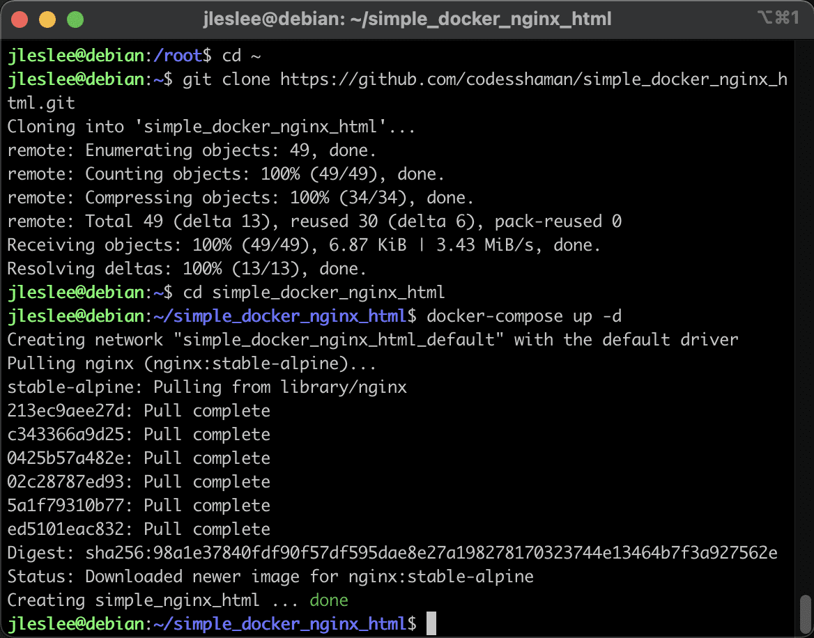

# Предварительная настройка Docker

Тепрь нам нужно начинать работать с докером. Для начала сделаем его удобным для нас, а так же протестируем его работу.

По умолчанию докер запускается либо с привилегией суперпользователя, либо любым пользователем, состоящем в группе docker и обладающим возможность делать запросы под суперпользователем (например, через sudo). 

Установим утиллиту sudo, позволяющую пользователю делать запросы от имени root. Для этого логинимся под суперпользователем ```su -``` и вводим команду:

```apt install sudo```

После успешной установки правим конфиг /etc/sudoers: ```nano /etc/sudoers```

Наша задача - добавить запись с именем нашего пользователя и правами, равнозначными правам root:


Сохраняем изменения и закрываем файл.

Теперь добавим нашего пользователя ```user``` в группу ```docker```

Вот так выглядит список групп нашего пользователя сейчас (```groups user```):


Добавим же нашего пользователя в группу командой 

```usermod -aG docker user```

И проверим, что добавление произошло:


Как мы можем видеть, в списке групп в самом конце добавилась группа docker. Это значит, что теперь мы можем вызывать наш докер из под обычного пользователя (если мы проделали добавление в группу не под root, а под пользователем через sudo, надо перелогиниться).

Так переключимся же на нашего пользователя и перейдём в его домашний каталог:

```su user```

```cd ~/```

Так же скачаем в корень простую конфигурацию из одного докер-контейнера для проверки работы системы:

```git clone https://github.com/codesshaman/simple_docker_nginx_html.git```


Теперь мы можем переходить в эту папку и запускать контейнер:

```cd simple_docker_nginx_html```

```docker-compose up -d```

Через некоторое время наш контейнер сбилдится и мы увидим сообщение об успешном запуске:



Это значит, что мы можем протестировать запущенный контейнер и правильность настройки конфигурации. Если на шаге 01 при пробросе портов мы всё сделали правильно, значит 80-й порт открыт, и зайдя в браузер по адресу локального хоста ```127.0.0.1``` мы увидим следующую картину:


Если вдруг мы видим что-либо другое, значит, у нас не открыты порты или 80-й порт чем-то занят на хостовой машине. Пройдитесь по гайду 01 и удостоверьтесь, что порты открыты, а так же проверьте все запущенные приложения. Если среди них есть сервера или иные приложения для работы с локальным хостом, отключаем их.

> ! Не забудьте отключить наш тестовый контейнер после проверки (всё-таки он занимает 80-й порт):

```docker-compose down```