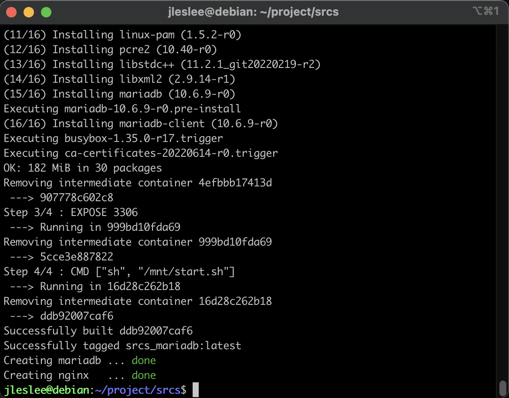
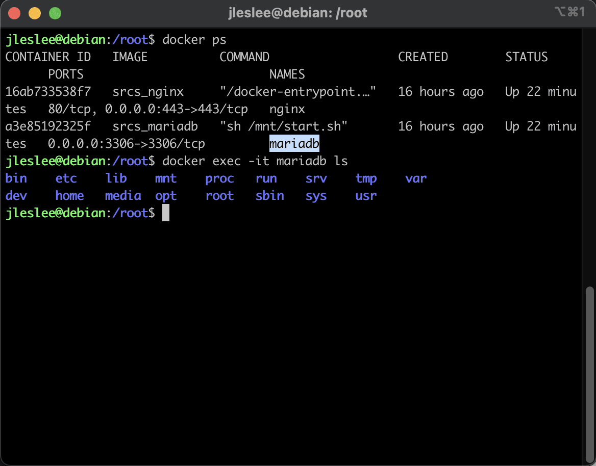
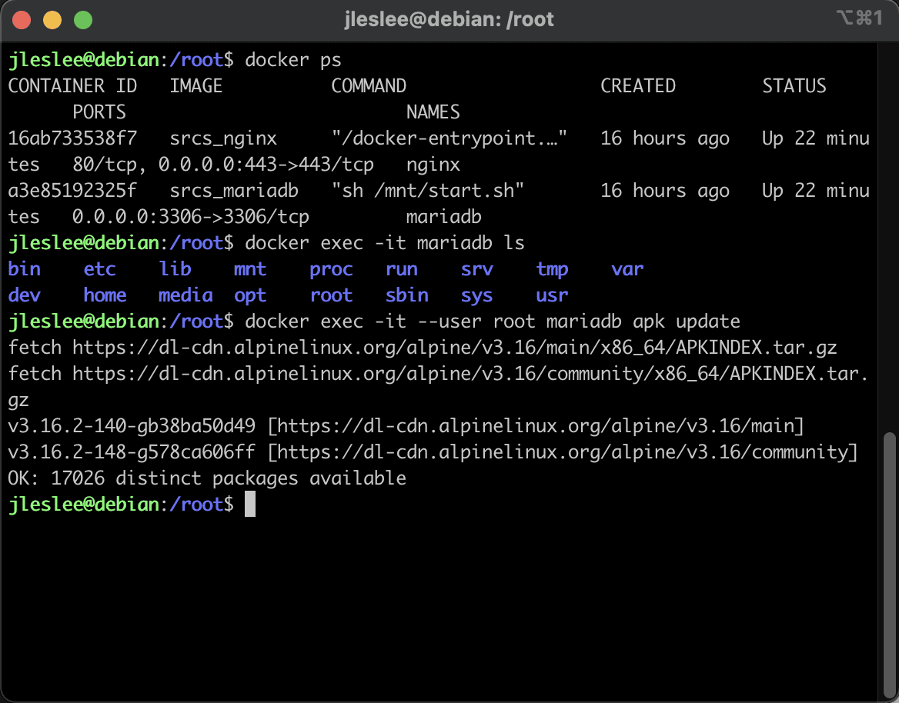
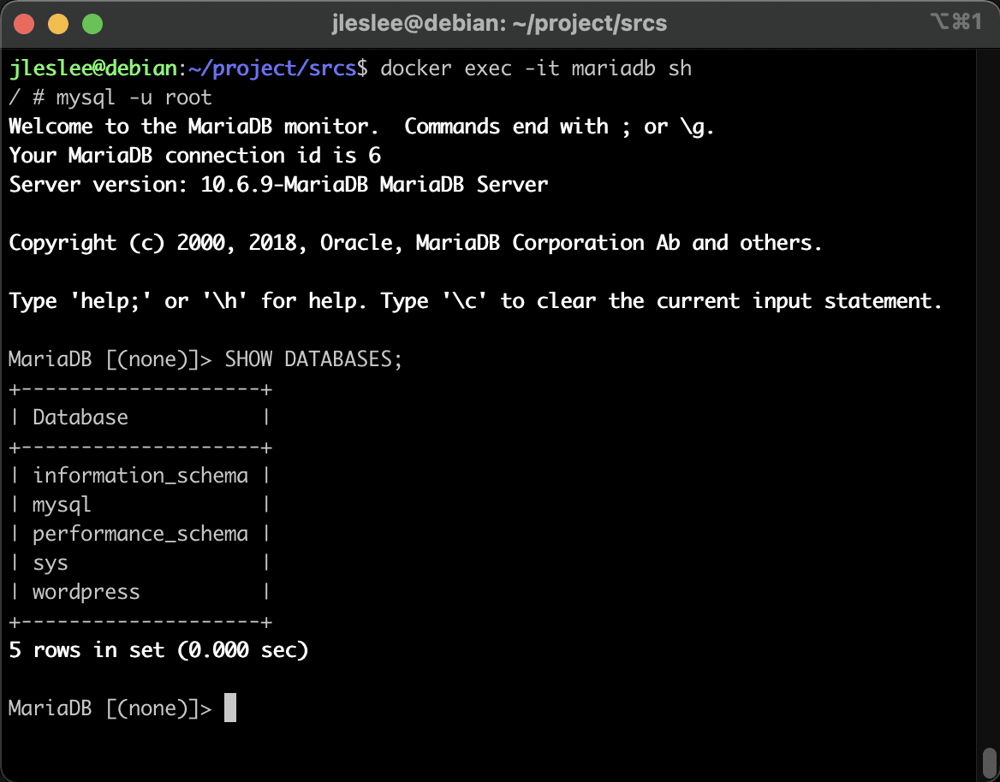

# Создание контейнера Mariadb

На этом шаге размеры моих снапшотов привысили два гига, и мне стало сложно качать их с облака, так как файлам более 2-х гигабайт mail урезает скорость.

Так как мне всё равно не нужно будет возвращаться к старым снапшотам, я решил оставить только новые конфигурации, а всё старое удалить.

Вот как выглядел список моих снапшотов до удаления:


Вот сколько их осталось после. Как можно заметить, я оставил только последние. 


Проблема низкой скорости загрузки решилась.

## Шаг 1. Скрипт настройки mariadb

Посмотрим, чего же от нас, простых русских девопсов, хотят французы:


А всё того же, что от настроек nginx. Dockerfile и какие-нибудь конфигурации. Что хранить в папке tools я не представляю, видимо фантазия у французов развита несколько лучше, чем у русских разработчиков. Я не сторонник различных вынесений баз данных или логов за пределы контейнера с последующими мучениями вокруг прав доступа на эти файлы, да и скрипт создания баз под wordpress мне кажется не самой лучшей идеей - wordpress сам создаст всё, что ему нужно, при установке. А потому папку tools я оставлю нетронутой.

Но вот папку conf мы задействуем для конфигурации запуска mariadb:

```cd ~/project/srcs/```

```nano requirements/mariadb/conf/start.sh```

Содержимое файла я подглядел в интернете, и это bash и sql:

```
#!/bin/bash
if [ ! -d "/run/mysqld" ]; then
	mkdir -p /run/mysqld
	chown -R mysql:mysql /run/mysqld
fi
if [ ! -d "/var/lib/mysql/mysql" ]; then
	chown -R mysql:mysql /var/lib/mysql
	mysql_install_db --basedir=/usr --datadir=/var/lib/mysql --user=mysql --rpm > /dev/null
	tfile=`mktemp`
	if [ ! -f "$tfile" ]; then
		return 1
	fi
	cat << EOF > $tfile
USE mysql;
FLUSH PRIVILEGES;
DELETE FROM	mysql.user WHERE User='';
DROP DATABASE test;
DELETE FROM mysql.db WHERE Db='test';
DELETE FROM mysql.user WHERE User='root' AND Host NOT IN ('localhost', '127.0.0.1', '::1');
ALTER USER 'root'@'localhost' IDENTIFIED BY '$MYSQL_ROOT_PASSWORD';
CREATE DATABASE $WP_DATABASE_NAME CHARACTER SET utf8 COLLATE utf8_general_ci;
CREATE USER '$WP_DATABASE_USR'@'%' IDENTIFIED by '$WP_DATABASE_PWD';
GRANT ALL PRIVILEGES ON $WP_DATABASE_NAME.* TO '$WP_DATABASE_USR'@'%';
FLUSH PRIVILEGES;
EOF
	/usr/bin/mysqld --user=mysql --bootstrap < $tfile
	rm -f $tfile
fi
sed -i "s|skip-networking|# skip-networking|g" /etc/my.cnf.d/mariadb-server.cnf
sed -i "s|.*bind-address\s*=.*|bind-address=0.0.0.0|g" /etc/my.cnf.d/mariadb-server.cnf
exec /usr/bin/mysqld --user=mysql --console
```

Скрипт возьмёт переменные окружения, которые хранятся нами в .env файле, удалит лишние хосты из бд, создаст базу данных и пользователя с паролем для wordpress.

В данном случае мы имеем пример грамотного хранения секретов (именно так называют токены, ключи, пароли и прочую важную информацию, которая не должна попасть к третьим лицам.) внутри .env файла.

Но для полного счастья нам нужно добавить .env в файл .dockerignore, который мы создадим в этой папке:

``echo ".env" > .dockerignore``

## Шаг 2. Создание Dockerfile

Тут всё будет несколько по-другому, чем с nginx. Ищем на dockerhub уже непосредственно голый alpine и на него накатываем Машу. Звучит пошловато, но именно этим мы сейчас и займёмся.

```nano requirements/mariadb/Dockerfile```

Убеждаемся, что существует ```alpine:latest``` и берём его за основу нашей системы:

```
FROM alpine:latest
RUN	apk update && apk upgrade && apk add --no-cache \
        mariadb \
        mariadb-client
EXPOSE 3306
CMD ["sh", "/mnt/start.sh"]
```

Как видим, всё предельно просто. Устанавливаем пакеты mariadb и mariadb-client (кстати, вместо mysql в alpine теперь mariadb, и установка пакетов mysql даст абсолютно такой же результат), открываем рабочий порт - 3306, и запускаем наш скрипт из примонтированной директории.


Теперь опишем то, как мы будем запускать это в docker-compose.

## Шаг 3. Создание docker-compose секции

Если мы находимся непосредственно в папке srcs, мы откроем наш docker-compose напрямую:

```nano docker-compose.yml```

Теперь ниже нашего nginx опишем секцию с нашей Машей. 

Сначала делаем всё то же самое: описываем сервис, указываем путь к Dockerfile, задаём имя контейнера и открываем порты:

```
  mariadb:
    build:
      context: .
      dockerfile: requirements/mariadb/Dockerfile
    container_name: mariadb
    ports:
      - "3306:3306"
```

Монтируем наш конфиг в специальную папку mnt, которая есть в корне любого linux, затем задаём параметры перезапуска.

```
  mariadb:
    build:
      context: .
      dockerfile: requirements/mariadb/Dockerfile
    container_name: mariadb
    ports:
      - "3306:3306"
    volumes:
      - "./requirements/mariadb/conf/:/mnt"
    restart: unless-stopped
```

Переменные берём из .env - файла, созданного скриптом на этапе создания директорий.

Посмотрим, что в нашем файле .env:

```cd ~/project/srcs/ && cat .env```

И увидим следующий вывод:

```
DOMAIN_NAME=<your_nickname>.42.fr
CERT_=./requirements/tools/<your_nickname>.42.fr.crt
KEY_=./requirements/tools/<your_nickname>.42.fr.key
MYSQL_ROOT_PASSWORD=123456
MYSQL_USER=dbuser
MYSQL_PASSWORD=1234
```

Копируем названия некоторых наших переменных в docker-compose, снабдив их $ и скобками:

```nano docker-compose.yml```

```
  mariadb:
    build:
      context: .
      dockerfile: requirements/mariadb/Dockerfile
    container_name: mariadb
    ports:
      - "3306:3306"
    volumes:
      - "./requirements/mariadb/conf/:/mnt/"
    restart: unless-stopped
    environment:
      MYSQL_ROOT_PWD:   ${MYSQL_ROOT_PASSWORD}
      WP_DATABASE_NAME: wordpress
      WP_DATABASE_USR:  ${MYSQL_USER}
      WP_DATABASE_PWD:  ${MYSQL_PASSWORD}
```

В environment заданы переменные окружения, которые при создании контейнера берутся из .env-файла и используются только на этапе создания контейнера, затем очищаются. Их подхватывает тот самый скрипт, созданный нами на первом шаге, выполняя SQL-команды в нашей развёрнутой базе.

И таким образом вся наша рабочая конфигурация на текущий момент выглядит следующим образом:

```
version: '3'

services:
  nginx:
    build:
      context: .
      dockerfile: requirements/nginx/Dockerfile
    container_name: nginx
    ports:
      - "443:443"
    volumes:
      - ./requirements/nginx/conf/:/etc/nginx/conf.d/
      - ./requirements/nginx/tools:/etc/nginx/ssl/
      - /home/user/simple_docker_nginx_html/public/html:/var/www/
    restart: unless-stopped

  mariadb:
    build:
      context: .
      dockerfile: requirements/mariadb/Dockerfile
    container_name: mariadb
    ports:
      - "3306:3306"
    volumes:
      - "./requirements/mariadb/conf/:/mnt/"
    restart: unless-stopped
    environment:
      MYSQL_ROOT_PWD:   ${MYSQL_ROOT_PASSWORD}
      WP_DATABASE_NAME: wordpress
      WP_DATABASE_USR:  ${MYSQL_USER}
      WP_DATABASE_PWD:  ${MYSQL_PASSWORD}
```

Запустим и проверим её работу:

```docker-compose up -d --build```

Как мы можем видеть, конфигурация успешно собрана, нам открылся порт 3306 на 3 шаге, а на четвёртом отработал наш тестовый скрипт start.sh:



Поздравляю с успешной установкой mariadb!

## Шаг 4. Учимся работать с контейнером

На этом этапе мы узнаем интересные вещи - например, как взаимодействовать с контейнерами, выполнять внутри контейнера команды или получить доступ к файловой системе контейнера. Это просто и не очень сильно отличается от работы в обычных юниксовых системах.

Собственно, единственная разница в том, что перед командой, передаваемой в контейнер, мы должны указать, в какой контейнер мы это передаём. Например, чтобы передать команду в контейнер с именем mariadb, мы можем обратиться к нему по имени:

``docker exec -it mariadb команда``

Всё. Так просто. Например, простейший ls будет выглядеть так:

``docker exec -it mariadb ls``



Ну а чтобы передать команду, выполняемую под root, нужно сказать, под каким пользователем мы должны выполнить её:

``docker exec -it --user root mariadb apk update``



А для того, чтобы войти в систему, необходимо передать название интерпретатора командной строки. В большинстве linux-систем интерпретатором обычно выступает bash (bourne again shell, — «возрождённый» shell), более совершенная и обновлённая версия shell. В облегчённых системах вроде alpine используется чистый либо урезанный shell.

Поэтому чтобы перейти в контейнер с современной ОС вроде debian, ubuntu или centos нужно вводить после имени контейнера ``bash``, а в более лёгких системах с шелл - ``sh``.

Итак, заглянем в наш контейнер:

``docker exec -it mariadb sh``

Как видим, пользователь по определению в контейнере является root-ом - в облегчённой alpine просто нет других пользователей (но можно создать).

А это значит, что и команда ``docker exec -it mariadb apk update`` сработает, так как разделения прав у такой системы нет. Но для полноценной работы с другими системами нужно уметь передавать в контейнер имя пользователя.

## Шаг 5. Проверка работы mariadb

Наш скрипт автоматически развернул базу данных и пользователя, нам осталось лишь проверить, что всё сработало. Заходим внутрь контейнера:

``docker exec -it mariadb sh``

Далее нам надо зайти внутрь mysql под каким-либо пользователем. У нас есть суперпользователь, которому мы так и не задали пароль. В рамках работы с продакшен-системами эту брешь всегда необходимо закрывать, нам же в случае с обучающим проектом это делать необязательно. Просто заходим под рутом:

 ``mysql -u root``

И запрашиваем показать все базы на языке SQL:

``SHOW DATABASES;``

Вывод должен быть таким:

```
+--------------------+
| Database           |
+--------------------+
| information_schema |
| mysql              |
| performance_schema |
| sys                |
| wordpress          |
+--------------------+
```



Выходим отсюда комбинацией Ctrl+D или через exit.

И на этом мы можем считать нашу работу законченной.

Если после этого шага нужно сделать снапшот, я бы для начала очистил все имеющиеся образы:

```cd ~/project/srcs/```

``docker-compose down``

``docker system prune -a``