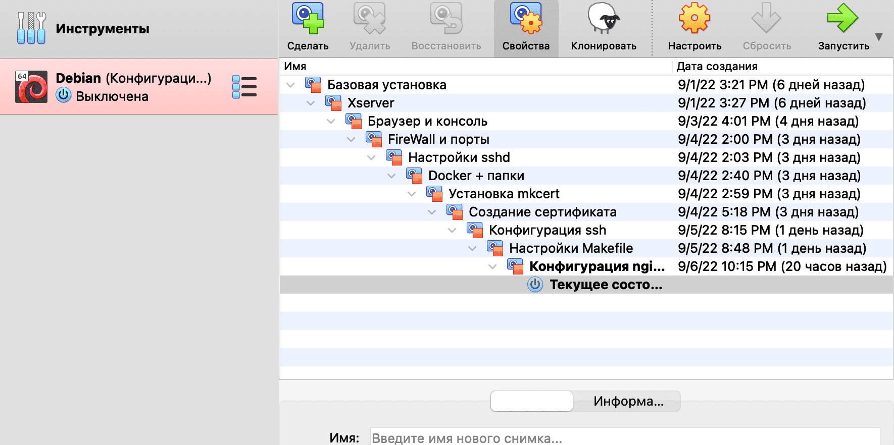

# Создание контейнера Mariadb

На этом шаге размеры моих снапшотов привысили два гига, и мне стало сложно качать их с облака, так как файлам более 2-х гигабайт mail урезает скорость.

Так как мне всё равно не нужно будет возвращаться к старым снапшотам, я решил оставить только новые конфигурации, а всё старое удалить.

Вот как выглядел список моих снапшотов до удаления:



Вот сколько их осталось после. Как можно заметить, я оставил только последние. 


Проблема низкой скорости загрузки решилась.

## Шаг 1. Создание Dockerfile

Посмотрим, чего же от нас, простых русских девопсов, хотят французы:


А всё того же, что от настроек nginx. Dockerfile и какие-нибудь конфигурации. Что хранить в папке tools я не представляю, видимо фантазия у французов развита несколько лучше, чем у русских разработчиков. Я не сторонник различных вынесений баз данных или логов за пределы контейнера с последующими мучениями вокруг прав доступа на эти файлы, да и скрипт создания баз под wordpress мне кажется не самой лучшей идеей - wordpress сам создаст всё, что ему нужно, при установке. А потому папку tools я оставлю нетронутой.

Начнём с создания контейнера.

```
FROM alpine:latest

RUN apk update && apk add --no-cache mariadb mariadb-client

RUN mkdir /var/run/mysqld; \
    chmod 777 /var/run/mysqld; \
    { echo '[mysqld]'; \
      echo 'skip-host-cache'; \
      echo 'skip-name-resolve'; \
      echo 'bind-address=0.0.0.0'; \
    } | tee  /etc/my.cnf.d/docker.cnf; \
    sed -i "s|skip-networking|skip-networking=0|g" \
      /etc/my.cnf.d/mariadb-server.cnf

RUN mysql_install_db --user=mysql --datadir=/var/lib/mysql

EXPOSE 3306

USER mysql
COPY tools/db.sh .
ENTRYPOINT  ["sh", "db.sh"]
CMD ["/usr/bin/mysqld", "--skip-log-error"]
```

Здесь мы устанавливаем без кеширования необходимые нам mariadb и mariadb-client. Далее мы в той же директиве RUN приводим в норму нашу рабочую конфигурацию. Делаем это одним RUN мы потому, что каждая директива RUN сздаёт новый слой в docker-образе, и лучше не плодить лишние RUN-ы без надобности. Команда tee отправляет результат вывода echo в файл, а команда sed заменяет строки в файлах по значению. Таким образом мы задаём минимально необходимый набор настроек без создания лишних конфигов внутри одного докер-файла.

Вторым слоем мы создаём базу данных с использованием изменённых конфигов. Затем открываем рабочий порт mariadb и переключаемся на пользователя mysql, созданного при установке БД.

И наконец, уже под этим пользователем мы запускаем базу данных.

## Шаг 2. Создание базы

Теперь создадим базу нашему wordpress-у. Для этого подключимся через терминал к нашей базе при помощи следующей команды:

``docker exec -it --user root mariadb mysql -u root``

Таким образом мы оказываемся в графической оболочке mariadb:

```MariaDB [(none)]>```

Здесь мы последовательно одна за одной вводим следующие команды:

``CREATE DATABASE wordpress;`` - создание базы

``CREATE USER 'wpuser'@'%' IDENTIFIED BY '123456';`` - создание пользователя

``GRANT ALL PRIVILEGES ON wordpress.* TO 'wpuser'@'%' IDENTIFIED BY '1234';`` - права на внешние хосты

``GRANT ALL PRIVILEGES ON wordpress.* TO 'wpuser'@'localhost' IDENTIFIED BY '1234';`` - права на локальный хост

``FLUSH PRIVILEGES;`` - применение изменений

``SHOW DATABASES;`` - проверка изменений

Вывод должен быть следующим:


Это значит, что наща база создана, и мы можем разворачивать на ней wordpress.