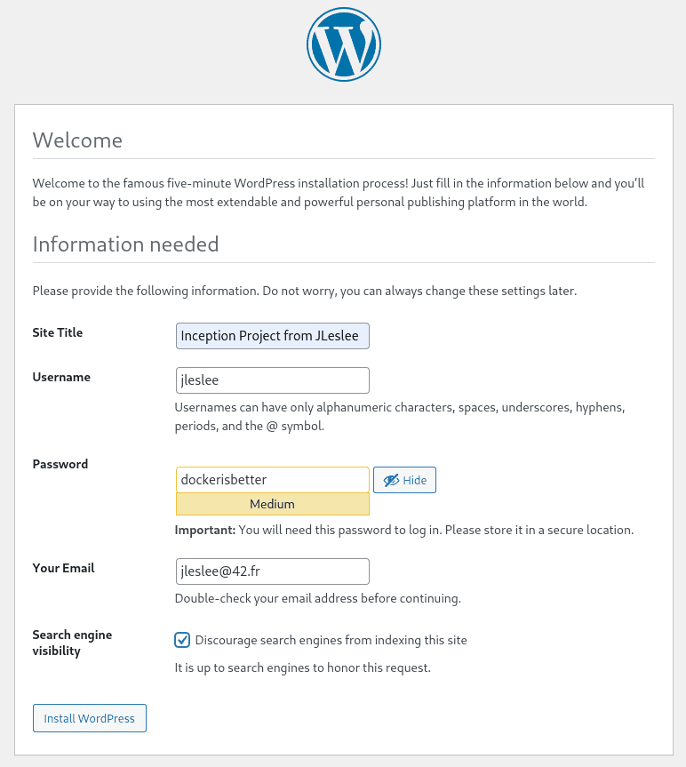
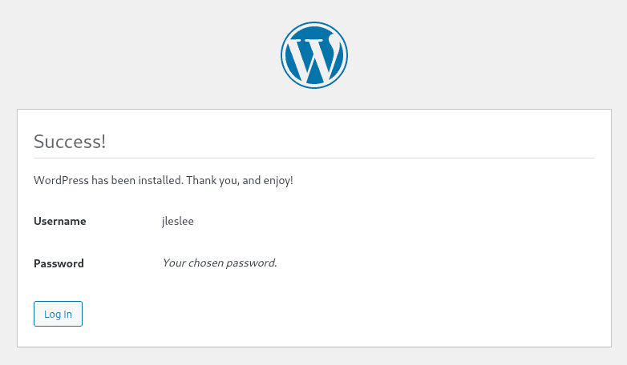
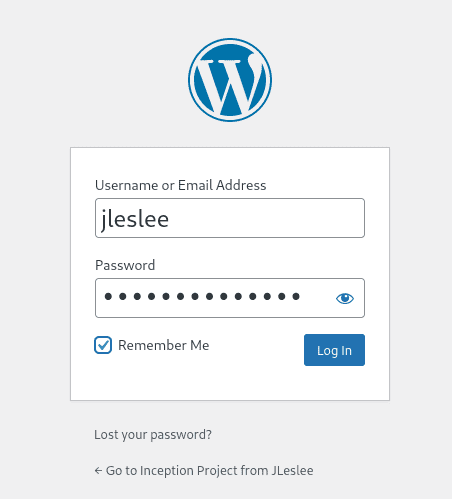
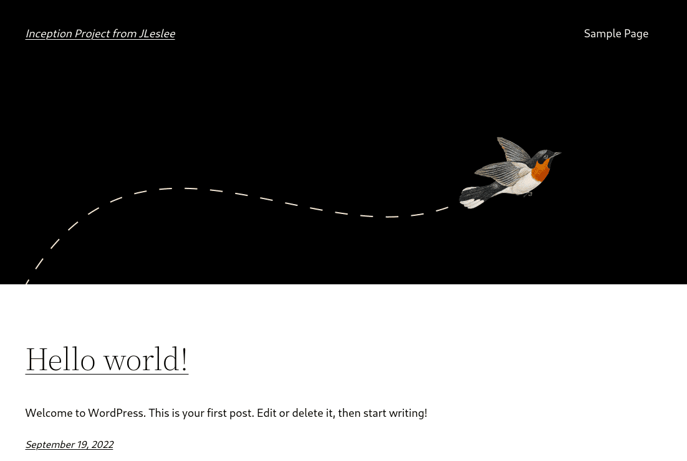

# Создание контейнера wordpress

Для общего понимания сделаем небольшое ревью задачи, разбив её на подзадачу.

Сначала выпишем список того, что нам нужно для контейнера. Это:

- php с плагинами для работы wordpress
- php-fpm для связи с nginx
- сам wordpress. Просто так, чтобы было.

Для настройки нам потребуется выполнить следующие действия:

- установить через Dockerfile php со всеми плагинами
- установить через Dockerfile все необходимые программы
- скачать и положить в /var/www сам вордпресс, так же через Dockerfile
- подсунуть в контейнер правильный конфиг fastcgi (www.conf)
- запустить в контейнере fastcgi через сокет php-fpm
- добавить все необходимые разделы в docker-compose
- установить порядок запуска контейнеров
- добавить раздел с wordpress контейнеру с nginx
- тестить чтобы всё работало

## Шаг 1. Настройка Dockerfile

Итак, мы переходим к настройке wordpress.  Действуем всё так же: берём за основу последний alpine и накатываем на него нужный нам софт.


``nano requirements/wordpress/Dockerfile``

Но накатываем по-умному, указав актуальную на сегодня версию php. На момент создания гайда (2022) это php 8, если с 2022 года прошло много времени, нужно зайти на [официальный сайт php](https://www.php.net/ "официальный сайт php") и посмотреть, не вышла ли более новая версия.

Поэтому версию PHP я укажу в переменной - аргументе командной строки. Задаёт переменную инструкция ARG. Так же при помощи этой инструкции я принимаю три аргумента из нашего .env-файла с секретами - имя базы, имя и пароь пользователя.

Разница в том, что ARG с параметрами задаёт переменную окружения с переданным параметром, а ARG без параметров берёт параметр из такой же переменной в docker-compose.

Сначала перечислим базовые компоненты: это php, на котором и работает наш wordpress, php-fpm для взаимодействия с nginx и php-mysqli для взаимодействия с mariadb:

```
FROM alpine:3.16
ARG PHP_VERSION=8 \
    DB_NAME \
    DB_USER \
    DB_PASS
RUN apk update && apk upgrade && apk add --no-cache \
    php${PHP_VERSION} \
    php${PHP_VERSION}-fpm \
    php${PHP_VERSION}-mysqli
```

Теперь обратимся к [документации wordpress](https://make.wordpress.org/hosting/handbook/server-environment/ "официальная документация wordpress") и посмотрим,что ещё нам понадобится.

Для полноценной работы нашего wordpress-а не поскупимся и загрузим все обязательные модули, опустив модули кэширования и дополнительные. Для бонусной части установим ещё и модуль redis. Так же загрузим пакет wget, нужный для скачивания самого wordpress, и пакет unzip для разархивирования архива со скачанным wordpress:

```
FROM alpine:3.16
ARG PHP_VERSION=8 \
    DB_NAME \
    DB_USER \
    DB_PASS
RUN apk update && apk upgrade && apk add --no-cache \
    php${PHP_VERSION} \
    php${PHP_VERSION}-fpm \
    php${PHP_VERSION}-mysqli \
    php${PHP_VERSION}-json \
    php${PHP_VERSION}-curl \
    php${PHP_VERSION}-dom \
    php${PHP_VERSION}-exif \
    php${PHP_VERSION}-fileinfo \
    php${PHP_VERSION}-mbstring \
    php${PHP_VERSION}-openssl \
    php${PHP_VERSION}-xml \
    php${PHP_VERSION}-zip \
    php${PHP_VERSION}-redis \
    wget \
    unzip
```

Далее исправим нужный нам конфиг - конфиг www.conf, чтобы наш fastcgi слушал все соединения по порту 9000 (путь /etc/php8/php-fpm.d/ зависит от установленной версии php!):

```
FROM alpine:3.16
ARG PHP_VERSION=8 \
    DB_NAME \
    DB_USER \
    DB_PASS
RUN apk update && apk upgrade && apk add --no-cache \
    php${PHP_VERSION} \
    php${PHP_VERSION}-fpm \
    php${PHP_VERSION}-mysqli \
    php${PHP_VERSION}-json \
    php${PHP_VERSION}-curl \
    php${PHP_VERSION}-dom \
    php${PHP_VERSION}-exif \
    php${PHP_VERSION}-fileinfo \
    php${PHP_VERSION}-mbstring \
    php${PHP_VERSION}-openssl \
    php${PHP_VERSION}-xml \
    php${PHP_VERSION}-zip \
    php${PHP_VERSION}-redis \
    wget \
    unzip \
    sed -i "s|listen = 127.0.0.1:9000|listen = 9000|g" \
    /etc/php8/php-fpm.d/www.conf \
    sed -i "s|;listen.owner = nobody|listen.owner = nobody|g" \
    /etc/php8/php-fpm.d/www.conf \
    sed -i "s|;listen.group = nobody|listen.group = nobody|g" \
    /etc/php8/php-fpm.d/www.conf \
    && rm -f /var/cache/apk/*
```

Принцип тот же, что и в предыдущем гайде. Меняем три строчки конфига sed-ом.

Последней командой мы очищаем кэш установленных модулей.

Далее нам надо скачать wordpress и разархивировать его по пути /var/www/. Для удобства сделаем этот путь рабочим командой WORKDIR:

```
FROM alpine:3.16
ARG PHP_VERSION=8 \
    DB_NAME \
    DB_USER \
    DB_PASS
RUN apk update && apk upgrade && apk add --no-cache \
    php${PHP_VERSION} \
    php${PHP_VERSION}-fpm \
    php${PHP_VERSION}-mysqli \
    php${PHP_VERSION}-json \
    php${PHP_VERSION}-curl \
    php${PHP_VERSION}-dom \
    php${PHP_VERSION}-exif \
    php${PHP_VERSION}-fileinfo \
    php${PHP_VERSION}-mbstring \
    php${PHP_VERSION}-openssl \
    php${PHP_VERSION}-xml \
    php${PHP_VERSION}-zip \
    php${PHP_VERSION}-redis \
    wget \
    unzip && \
    sed -i "s|listen = 127.0.0.1:9000|listen = 9000|g" \
      /etc/php8/php-fpm.d/www.conf && \
    sed -i "s|;listen.owner = nobody|listen.owner = nobody|g" \
      /etc/php8/php-fpm.d/www.conf && \
    sed -i "s|;listen.group = nobody|listen.group = nobody|g" \
      /etc/php8/php-fpm.d/www.conf && \
    rm -f /var/cache/apk/*
WORKDIR /var/www
RUN wget https://wordpress.org/latest.zip && \
    unzip latest.zip && \
    cp -rf wordpress/* . && \
    rm -rf wordpress latest.zip
COPY ./requirements/wordpress/conf/wp-config-create.sh .
RUN sh wp-config-create.sh && rm wp-config-create.sh && \
    chmod -R 0777 wp-content/
CMD ["/usr/sbin/php-fpm8", "-F"]
```
После назначения рабочей директори мы загрузили wget-ом последнюю версию wordpress, разархивировали её и удалили все исходные файлы.

После скачивания wordpress-а мы скопируем и выполним наш конфигурационный файл, который создадим на четвёртом шаге. После выполнения мы заставим его самовыпилиться при помощи rm. Ну и дадим всем пользователям права на папку wp-conten, чтобы наша CMS могла скачивать темы, плагины, сохранять картинки и прочие файлы.

CMD же запускает наш установленный php-fpm (внимание: версия должна соответствовать установленной!)

## Шаг 2. Конфигурация docker-compose

Теперь добавим в наш docker-compose секцию с wordpress.

``nano docker-compose.yml``

Для начала пропишем следующее:

```
  wordpress:
    build:
      context: .
      dockerfile: requirements/wordpress/Dockerfile
    container_name: wordpress
    depends_on:
      - mariadb
    restart: always
```

Директива depends_on означает, что wordpress зависит от mariadb и не запустится, пока контейнер с базой данных не соберётся. Самым "шустрым" из наших контейнеров будет nginx - ввиду малого веса он соберётся и запустится первым. А вот база и CMS собираются примерно равное время, и чтобы не случилась, что wordpress начинает устанавливаться на ещё не развёрнутую базу потребуется указать эту зависимость.

Далее мы передадим в контейнер те самые "секреты", хранимые в .env-файле:

```
      args:
        DB_NAME: ${DB_NAME}
        DB_USER: ${DB_USER}
        DB_PASS: ${DB_PASS}
```

Эти аргументы мы помещаем в раздел build:

```
  wordpress:
    build:
      context: .
      dockerfile: requirements/wordpress/Dockerfile
      args:
        DB_NAME: ${DB_NAME}
        DB_USER: ${DB_USER}
        DB_PASS: ${DB_PASS}
    container_name: wordpress
    depends_on:
      - mariadb
    restart: always
    volumes:
      - wp-volume:/var/www/
```

## Шаг 3. Создание разделов и сети

У nginx и wordpress должен быть общий раздел для обмена данными. Так же по заданию нужен раздел для хранения базы данных. И всё это должно храниться в нашем /home/<username>/data. Можно примонтировать туда и туда одну и ту же папку, но для удобства создадим раздел, указав путь к его папке:

```
volumes:
  wp-volume:
    driver_opts:
      o: bind
      type: none
      device: /home/${USER}/data/wordpress

  db-volume:
    driver_opts:
      o: bind
      type: none
      device: /home/${USER}/data/mariadb
```

Далее по заданию мы должны объединить наши контейнеры в единую сеть. На самом деле все контейнеры, которые прописаны внутри одного docker-compose - файле или конфигурации которых находятся в одной папке, автоматически объединяются в общую сеть. Однако название сети задаётся не нами. А ведь обращаться к сети иногда бывает полезно.

Для того, чтобы наша сеть была доступна нам по имени, давайте создадим вдобавок к дефолтной нашу собственную сеть. Создаётся она крайне просто:

```
networks:
    inception:
        driver: bridge
```

Теперь добавим этот раздел и нашу сеть ко всем контейнерам, которые от него зависят. И не забудем раскомментировать зависимости nginx-а. Таким образом вся наша конфигурация будет выглядеть так:

```
version: '3'

services:
  nginx:
    build:
      context: .
      dockerfile: requirements/nginx/Dockerfile
    container_name: nginx
    depends_on:
      - wordpress
    ports:
      - "443:443"
    networks:
      - inception
    volumes:
      - ./requirements/nginx/conf/:/etc/nginx/http.d/
      - ./requirements/nginx/tools:/etc/nginx/ssl/
      - wp-volume:/var/www/
    restart: always

  mariadb:
    build:
      context: .
      dockerfile: requirements/mariadb/Dockerfile
      args:
        DB_NAME: ${DB_NAME}
        DB_USER: ${DB_USER}
        DB_PASS: ${DB_PASS}
        DB_ROOT: ${DB_ROOT}
    container_name: mariadb
    ports:
      - "3306:3306"
    networks:
      - inception
    restart: always

  wordpress:
    build:
      context: .
      dockerfile: requirements/wordpress/Dockerfile
      args:
        DB_NAME: ${DB_NAME}
        DB_USER: ${DB_USER}
        DB_PASS: ${DB_PASS}
    container_name: wordpress
    depends_on:
      - mariadb
    restart: always
    networks:
      - inception
    volumes:
      - wp-volume:/var/www/

volumes:
  wp-volume:
    driver_opts:
      o: bind
      type: none
      device: /home/${USER}/data/wordpress

  db-volume:
    driver_opts:
      o: bind
      type: none
      device: /home/${USER}/data/mariadb

networks:
    inception:
        driver: bridge
```

Так же создадим папки для наших разделов в домашнем каталоге:

``mkdir ~/data/``

``mkdir ~/data/wordpress``

``mkdir ~/data/mariadb``

## Шаг 4. Создание файла конфигурации worpdress

Нам нужно будет скопировать в папку wordpress-а конфигурационный файл, который соединит нас с контейнером базы данных.

Создадим этот файл в папке conf:

``nano requirements/wordpress/conf/wp-config-create.sh``

Вставим в него следующее содержимое:

```
#!bin/sh
if [ ! -f "/var/www/wp-config.php" ]; then
cat << EOF > /var/www/wp-config.php
<?php
define( 'DB_NAME', '${DB_NAME}' );
define( 'DB_USER', '${DB_USER}' );
define( 'DB_PASSWORD', '${DB_PASS}' );
define( 'DB_HOST', 'mariadb' );
define( 'DB_CHARSET', 'utf8' );
define( 'DB_COLLATE', '' );
define('FS_METHOD','direct');
\$table_prefix = 'wp_';
define( 'WP_DEBUG', false );
if ( ! defined( 'ABSPATH' ) ) {
define( 'ABSPATH', __DIR__ . '/' );}
define( 'WP_REDIS_HOST', 'redis' );
define( 'WP_REDIS_PORT', 6379 );
define( 'WP_REDIS_TIMEOUT', 1 );
define( 'WP_REDIS_READ_TIMEOUT', 1 );
define( 'WP_REDIS_DATABASE', 0 );
require_once ABSPATH . 'wp-settings.php';
EOF
fi
```

Обратим внимание на \$table_prefix = 'wp_'; Чтобы в $table_prefix не записалась пустая строка (так как в bash у нас нет такой переменной), мы обязательно экранируем строку обратным слэшем - "\".

Некоторые настройки, касающиеся redis, пригодятся нам только в бонусной части. В основной они тоже не будут нам мешать.

## Шаг 5. Изменение конфигурации nginx

Нам необходимо изменить конфигурацию nginx-а чтобы тот обрабатывал только php-файлы. Для этого удалим из конфига все index.html.

``nano requirements/nginx/conf/nginx.conf``

Для полного счастья нам осталось раскомментировать блок nginx-а, обрабатывающий php, чтобы наш nginx.conf выглядел следующим образом:

```
server {
    listen      443 ssl;
    server_name  <your_nickname>.42.fr www.<your_nickname>.42.fr;
    root    /var/www/;
    index index.php;
    ssl_certificate     /etc/nginx/ssl/<your_nickname>.42.fr.crt;
    ssl_certificate_key /etc/nginx/ssl/<your_nickname>.42.fr.key;
    ssl_protocols       TLSv1.2 TLSv1.3;
    ssl_session_timeout 10m;
    keepalive_timeout 70;
    location / {
        try_files $uri /index.php?$args;
        add_header Last-Modified $date_gmt;
        add_header Cache-Control 'no-store, no-cache';
        if_modified_since off;
        expires off;
        etag off;
    }
    location ~ \.php$ {
        fastcgi_split_path_info ^(.+\.php)(/.+)$;
        fastcgi_pass wordpress:9000;
        fastcgi_index index.php;
        include fastcgi_params;
        fastcgi_param SCRIPT_FILENAME $document_root$fastcgi_script_name;
        fastcgi_param PATH_INFO $fastcgi_path_info;
    }
}
```

Обязательно заменим все <your_nickname> на ник в интре чтобы это работало.

Вот теперь наша конфигурация готова к запуску.

# Шаг 6. Проверка работы конфигурации

Итак, после того, как мы выполним ``docker-compose up -d --build`` в нашей директории ``~/project/srcs``, мы некоторое время будем наблюдать за сборкой конфигурации. И наконец мы обнаружим, что всё собралось и работает:


На всякий случай проверим работоспособность конфигурации. Выполним несколько команд. Сначала прослушаем сокет php:

``docker exec -it wordpress ps aux | grep 'php'``

Вывод должен быть следующим:

```
    1 root      0:00 {php-fpm8} php-fpm: master process (/etc/php8/php-fpm.conf
    9 nobody    0:00 {php-fpm8} php-fpm: pool www
   10 nobody    0:00 {php-fpm8} php-fpm: pool www
```

Затем посмотрим работу php, узнав версию:

``docker exec -it wordpress php -v``

```
PHP 8.0.22 (cli) (built: Aug  5 2022 23:54:32) ( NTS )
Copyright (c) The PHP Group
Zend Engine v4.0.22, Copyright (c) Zend Technologies
```

И наконец, проверим, все ли модули установились:

``docker exec -it wordpress php -m``

```
[PHP Modules]
Core
curl
date
dom
exif
fileinfo
filter
hash
json
libxml
mbstring
mysqli
mysqlnd
openssl
pcre
readline
Reflection
SPL
standard
xml
zip
zlib

[Zend Modules]
```

...и вуаля! - перед нами откроется панель настроек:


И вот, когда вы успешно запустили вордпресс, где-то в Париже возрадовался один разработичк...


## Шаг 7. Настройка wordpress

После того как мы проверили работу всех систем, мы можем приступать к настройке установленного wordpress-а. Для этого мы открываем наш сайт в браузере хостовой машины:

``https://127.0.0.1``

Если мы хотим видеть наш сайт, не забываем указывать протокол https.

Вбиваем нужные нам логин, пароль, имя сайта (или сохраняем сгенерированный пароль в блокнотик), я записал следующее:



После нажатия кнопки "Установить Wordpress" мы увидим окошко с сообщением об успешной установке и предложением залогиниться:



Нажимаем кнопку логина, вводим свой логин и пароль:



И попадаем на стартовую страницу нашего чистого wordpress-а!



Поздравляю, мы завершили установку и настройку нашего wordpress. Теперь мы можем накатить на него тему, которая нам понравится, и получить прекрасный локальный сайт, который будет отображаться в браузере!

## Шаг 8. Изменение Makefile

Так же не забываем копировать наш Makefile. Его придётся немного изменить, потому как docker-compose у нас лежит по пути srcs. Это накладывает определённые ограничения на нас, потому как делая make на директорию выше мы не подхватим наши секреты (система будет искать .env в той же директории, где лежит Makefile). Поэтому указываем нашему docker-compose не только путь к ./srcs, но и путь к .env. Делается это при помощи указания флага  --env-file:

```
name = inception
all:
	@printf "Launch configuration ${name}...\n"
	@docker-compose -f ./srcs/docker-compose.yml --env-file srcs/.env up -d

build:
	@printf "Building configuration ${name}...\n"
	@docker-compose -f ./srcs/docker-compose.yml --env-file srcs/.env up -d --build

down:
	@printf "Stopping configuration ${name}...\n"
	@docker-compose -f ./srcs/docker-compose.yml --env-file srcs/.env down

re: down
	@printf "Rebuild configuration ${name}...\n"
	@docker-compose -f ./srcs/docker-compose.yml --env-file srcs/.env up -d --build

clean: down
	@printf "Cleaning configuration ${name}...\n"
	@docker system prune -a
	@sudo rm -rf ~/data/wordpress/*
	@sudo rm -rf ~/data/mariadb/*

fclean:
	@printf "Total clean of all configurations docker\n"
	@docker stop $$(docker ps -qa)
	@docker system prune --all --force --volumes
	@docker network prune --force
	@docker volume prune --force
	@sudo rm -rf ~/data/wordpress/*
	@sudo rm -rf ~/data/mariadb/*

.PHONY	: all build down re clean fclean
```

Перед сохранением в облако советую сделать make fclean.

***

Развёртывание проекта происходит ``make build``, остановка - ``make down``, запуск после остановки - ``make`` и т.д.

На этом основная часть проекта закончена. После настроек wordpress проект можно будет сдать. Так же нужно сохранить в репозиторий все исходники и уметь грамотно разворачивать из них свой проект.