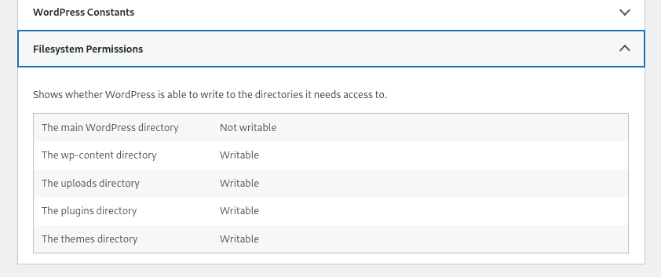

# База Redis для кеша wordpress

Приступим к бонусной части проекта. Для начала создадим базу Redis для кеширования нашего wordpress.

Но сначала сделаем красоту из нашего дефолтного wp ибо видеть на своём сайте убогую тему по умолчанию как-то печально.

Начнём с проверки: посмотрим, всё ли мы правильно сделали. Заходим в инструменты -> здоровье сайта:


На странице здоровья переходим на вкладку информации:


Извиняюсь, не тот скрин... Итак, переходим на вкладку инфо:


В самом низу открываем выпадающий список "разрешения файловой системы". Должно быть так, как показано на скриншоте:



Для ядра wordpress запись должна быть недоступна по соображениям безопасности, для остальных же разделов - доступна.

Если вдруг какие-либо права на запись отсутствуют или что-то не так, как на этом скриншоте, можно ещё раз копипастить Dockerfile из гайда по wordpress и перезапустить проект. Должно заработать.

Далее установим нормальную тему. Переходим в меню "внешний вид -> темы":


Добавить новую тему можно кнопкой "Add New":


Тут мы можем выбрать любую понравившуюся тему. Мне приглянулась Inspiro:


После установки на месте кнопки "установить" появится кнопка "активировать". Нажимаем её и радуемся:


Можно поэкспериментировать так же с установкой плагинов и оформлением хотя бы главной страницы сайта. Просто, для практики. Ну а потом приступать к установки Redis.

## Шаг 1. Установка Redis

Для начала, как обычно, создадим Dockerfile для нашего редиса.

```
FROM alpine:3.16

RUN apk update && apk upgrade && \
    apk add --no-cache redis && \
    sed -i "s|bind 127.0.0.1|#bind 127.0.0.1|g"  /etc/redis.conf && \
    sed -i "s|# maxmemory <bytes>|maxmemory 20mb|g"  /etc/redis.conf && \
    echo "maxmemory-policy allkeys-lru" >> /etc/redis.conf

EXPOSE 6379

CMD [ "redis-server" , "/etc/redis.conf" ]
```

Здесь мы выбрали актуальную версию alpine, установили туда редиску и немного поправили ей конфиг. Затем открыли дефолтный порт и запустили сервер редис, скормив ему готовый конфиг. Вуаля.

## Шаг 2. Настройка docker-compose

В docker-compose.yml мы добавим секцию редиса:

```
  redis:
    build:
      context: .
      dockerfile: bonus/redis/Dockerfile
    container_name: redis
    ports:
      - "6379:6379"
    networks:
      - inception
    restart: always
```

Тип перезапуска мы поменяем, так как подобные базы должны работать постоянно. Остальное должно быть понятно по предыдущим контейнерам.

## Шаг 3. Запуск и проверка

Снова перезапускаем конфигурацию. Так как никаких лишних конфигов у нас нет и переменные окружения передавать не надо, можем выйти в папку project и использовать Makefile:

``make re``

После того, как проект соберётся, проверим его работу следующим образом:

``docker exec -it redis redis-cli``

После этой команды мы попадём в окружение редиса:

``127.0.0.1:6379>``

Здесь мы должны ввести простую команду:

``ping``

Ответ должен быть таким:

``PONG``

Если мы получили этот ответ, значит наш сервер работает и прекрасно пингуется. Поздравляю вас с этим замечательным событием!

## Шаг 4. Пересборка контейнера wordpress

Теперь перед нами встаёт задача подружить наш контейнер редиса и контейнер wordpress-а.

В первую же инструкцию RUN, в раздел установки пакетов, добавляем ещё одну строку. Установим пакет php-redis:

``php${PHP_VERSION}-redis \``

Так же я создал отдельный скрипт для создания wp-config, а потому wp-config-create.sh заменяю на wp-config-create_bonus.sh.

Таким образом наш Dockerfile будет содержать следующий код:

```
FROM alpine:3.16
ARG PHP_VERSION=8 \
    DB_NAME \
    DB_USER \
    DB_PASS
RUN apk update && apk upgrade && apk add --no-cache \
    php${PHP_VERSION} \
    php${PHP_VERSION}-fpm \
    php${PHP_VERSION}-mysqli \
    php${PHP_VERSION}-json \
    php${PHP_VERSION}-curl \
    php${PHP_VERSION}-dom \
    php${PHP_VERSION}-exif \
    php${PHP_VERSION}-fileinfo \
    php${PHP_VERSION}-mbstring \
    php${PHP_VERSION}-openssl \
    php${PHP_VERSION}-xml \
    php${PHP_VERSION}-zip \
    php${PHP_VERSION}-redis \
    wget \
    unzip && \
    sed -i "s|listen = 127.0.0.1:9000|listen = 9000|g" \
      /etc/php8/php-fpm.d/www.conf && \
    sed -i "s|;listen.owner = nobody|listen.owner = nobody|g" \
      /etc/php8/php-fpm.d/www.conf && \
    sed -i "s|;listen.group = nobody|listen.group = nobody|g" \
      /etc/php8/php-fpm.d/www.conf && \
    rm -f /var/cache/apk/*
WORKDIR /var/www
RUN wget https://wordpress.org/latest.zip && \
    unzip latest.zip && \
    cp -rf wordpress/* . && \
    rm -rf wordpress latest.zip
COPY ./requirements/wordpress/conf/wp-config-create_bonus.sh .
RUN sh wp-config-create_bonus.sh && rm wp-config-create_bonus.sh && \
    chmod -R 0777 wp-content/
CMD ["/usr/sbin/php-fpm8", "-F"]
```
И это всё, что нам нужно добавить в этот конфиг.

# Шаг 5. Изменение конфига wp

Далее мы должны изменить конфигурацию wp-config - файла. Для бонусной части я просто создал новый конфиг с именем ``wp-config-create_bonus.sh``. В него я добавил строки, отвечающие за хранение кеша в redis и теперь этот файл выглядит так:

```
#!bin/sh

if [ ! -f "/var/www/wp-config.php" ]; then

        cat << EOF > /var/www/wp-config.php
<?php
define( 'DB_NAME', '${DB_NAME}' );
define( 'DB_USER', '${DB_USER}' );
define( 'DB_PASSWORD', '${DB_PASS}' );
define( 'DB_HOST', 'mariadb' );
define( 'DB_CHARSET', 'utf8' );
define( 'DB_COLLATE', '' );
define('FS_METHOD','direct');
\$table_prefix = 'wp_';
define( 'WP_DEBUG', false );
if ( ! defined( 'ABSPATH' ) ) {
	define( 'ABSPATH', __DIR__ . '/' );
}
define( 'WP_REDIS_HOST', 'redis' );
define( 'WP_REDIS_PORT', 6379 );
define( 'WP_REDIS_TIMEOUT', 1 );
define( 'WP_REDIS_READ_TIMEOUT', 1 );
define( 'WP_REDIS_DATABASE', 0 );
require_once ABSPATH . 'wp-settings.php';
EOF

fi
```

Здесь мы используем имя хоста (redis), которое должно соответствовать имени контейнера с базой redis, порт по умолчанию (6379), который должен быть открыт в контейнере redis и прописан в docker-compose, для подключения к этой базе.

Шаг 6. Установка плагина Redis Object Cache

Заходим в wordpress на страницу поиска плагинов:


Вводим в поиск "Redis" и устанавливаем найденный плагин:


После установки нам нужно нажать "Активировать", и наш плагин заработет.

Чтобы проверить работу кэша выполняем следующую команду:

``docker exec -it redis redis-cli monitor``

Если вывод OK - значит у нас всё работает, можем выходить из монитора по Ctrl+C.