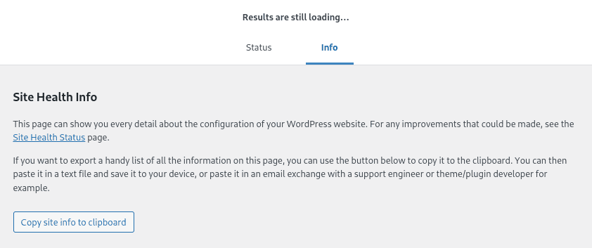

# База Redis для кеша wordpress

Приступим к бонусной части проекта. Для начала создадим базу Redis для кеширования нашего wordpress.

Но сначала сделаем красоту из нашего дефолтного wp ибо видеть на своём сайте убогую тему по умолчанию как-то печально.

Начнём с проверки: посмотрим, всё ли мы правильно сделали. Заходим в инструменты -> здоровье сайта:

На странице здоровья переходим на вкладку информации:

Извиняюсь, не тот скрин... Итак, переходим на вкладку инфо:

В самом низу открываем выпадающий список "разрешения файловой системы". Должно быть так, как показано на скриншоте:

Для ядра wordpress запись должна быть недоступна по соображениям безопасности, для остальных же разделов - доступна.

Если вдруг какие-либо права на запись отсутствуют или что-то не так, как на этом скриншоте, можно ещё раз копипастить Dockerfile из гайда по wordpress и перезапустить проект. Должно заработать.

Далее установим нормальную тему. Переходим в меню "внешний вид -> темы":

Добавить новую тему можно кнопкой "Add New":

Тут мы можем выбрать любую понравившуюся тему. Мне приглянулась Inspiro:

После установки на месте кнопки "установить" появится кнопка "активировать". Нажимаем её и радуемся:

Можно поэкспериментировать так же с установкой плагинов и оформлением хотя бы главной страницы сайта. Просто, для практики. Ну а потом приступать к установки Redis.

## Шаг 1. Установка Redis
