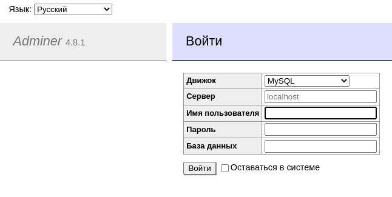

# Административный интерфейс adminer

Теперь нам нужно установить административную панель adminer. По сути это лёгкая СУБД, которая содержит всего лишь один php-файл!

Стало быть, для её развёртывания надо установить в контейнер php нужной нам версии, скачать нашу панельку и скормить её интерпретатору php. Звучит просто. Главное - не забыть открыть порты.

Зачем она вообще нужна? Для того, чтобы можно было открыть базу данных в графическом режиме и ~~следить за манекенами~~ делать в ней любые нужные нам операции без SQL-запросов и ручных команд.


Поехали!

# Шаг 1. Создание Dockerfile

Заходим на [официальный сайт adminer](https://www.adminer.org/ "скачать adminer") и смотрим особенности и зависимости:


Как мы можем видеть, adminer работает с php-8 и поддерживает нашу Машу. Но как понять, какие именно пакеты необходимы для adminer в качестве зависимостей? Я не нашёл эту информацию в открытых источниках, потому подошёл к этому вопросу с другой стороны.

Аналогом adminer является PhpMyAdmin, и работает эта штука на том же php. Но в отличие от Adminer-а, все зависимости PhpMyAdmin прекрасно задокументированы в [alpine-овской wiki](https://wiki.alpinelinux.org/wiki/PhpMyAdmin "список пакетов для PMA"). Именно инструкция для PMA помогла мне запустить adminer: я взял все зависимости отсюда из строки "Install the additional packages" и прогнал их через [поиск пакетов](https://pkgs.alpinelinux.org/packages?name=&branch=edge&repo=&arch=&maintainer= "поиск пакетов alpine"), подставляя вместо php7- наш текущий php8-.

Отсеялись php8-mcrypt, php8-xmlrpc и, на удивление, php8-json. Удивление всё же оказалось приятным - если первые два пакета просто не реализованы ещё на alpine, то модуль json вошёл в ядро php начиная с версии 8.


Так же я убрал ненужные нам lighttpd и fast cgi. Итак, список пакетов сформирован, приступим к созданию Dockerfile:

``nano bonus/adminer/Dockerfile``

За основу возьмём всё тот же alpine 3.16, занесём в переменную версию php и установим все необходимые нам пакеты из готового списка:

```
FROM alpine:3.16

ARG PHP_VERSION=8

RUN apk update && apk upgrade && apk add --no-cache \
    php${PHP_VERSION} \
    php${PHP_VERSION}-common \
    php${PHP_VERSION}-session \
    php${PHP_VERSION}-iconv \
    php${PHP_VERSION}-gd \
    php${PHP_VERSION}-curl \
    php${PHP_VERSION}-xml \
    php${PHP_VERSION}-mysqli \
    php${PHP_VERSION}-imap \
    php${PHP_VERSION}-cgi \
    php${PHP_VERSION}-pdo \
    php${PHP_VERSION}-pdo_mysql \
    php${PHP_VERSION}-soap \
    php${PHP_VERSION}-posix \
    php${PHP_VERSION}-gettext \
    php${PHP_VERSION}-ldap \
    php${PHP_VERSION}-ctype \
    php${PHP_VERSION}-dom \
    php${PHP_VERSION}-simplexml \
    wget

WORKDIR /var/www

RUN wget https://github.com/vrana/adminer/releases/download/v4.8.1/adminer-4.8.1.php && \
    mv adminer-4.8.1.php index.php && chown -R root:root /var/www/

EXPOSE 8080

CMD	[ "php", "-S", "[::]:8080", "-t", "/var/www" ]
```

Как видим, я делаю рабочим каталог /vaar/www, качаю adiner в этот каталог и называю его index.php потому что интерпретатору надо скармливать папку, а в папке он ищет именно индексный файл.

Затем я открываю рабочий порт adminer-а и в CMD натравливаю php-шный интерпретатор на наш рабочий каталог с индексным файлом. Так php увидит наш файл и запустит adminer.

# Шаг 2. Конфигурация docker-compose

Добавляем секцию adminer в docker-compose:

```
  adminer:
    build:
      context: .
      dockerfile: bonus/adminer/Dockerfile
    container_name: adminer
    depends_on:
      - mariadb
    ports:
      - "8080:8080"
    networks:
     - inception
    restart: always
```

Запускаться он должен после mariadb, порт 8080 должен быть открыт. Подключаем его к нашей сети inception.

# Шаг 3. Перезапуск конфигурации

Итак, мы сделали всё что нужно, осталось запустить нашу конфигурацию. Однако мы сделаем небольшую проверку, чтобы наглядно посмотреть, на каком этапе создаётся база wordpress.

Эти действия удалят все файлы и настройки нашего wordpress-а, поэтому все важные данные должны быть сохранены. Если нет желания удалять конфигурацию, то можно просто ознакомиться с этим и последующими шагами.

Сначала выйдем в директорию с нашим Makefile:

``cd ~/project/``

Теперь очистим всю конфигурацию, включая файлы из раздела wordpress командой

``make clean``

Мы помним, что для первой сборки необходимо запускать конфигурацию через docker-compose. Переходим в каталог с docker-compose.yml файлом:

``cd srcs``

И запускаем конфигурацию:

``docker-compose up -d --build``

Когда всё запустится первым делом открываем в браузере хостовой (не виртуальной, хотя можно и там, но раз уж прокинуты порты, то зачем себя ограничивать?) машины адрес нашего adminer-а:

``http://localhost:8080/``

И мы увидим страницу входа:



Таким образом мы убедились, что у нас всё работает! Итак, что же с этим делать?

# Шаг 4. Вход в adminer

Для начала нам нужен логин и пароль. Посмотрим cat-ом наш .env-файл:

``cat .env``

Мы получим следующий вывод:

```
DOMAIN_NAME=jleslee.42.fr
CERT_=./requirements/tools/jleslee.42.fr
KEY_=./requirements/tools/jleslee.42.fr
DB_NAME=wordpress
DB_ROOT=rootpass
DB_USER=wpuser
DB_PASS=wppass
FTP_USR=ftpuser
FTP_PWD=ftppass
```

Отсюда нам нужны логин и пароль пользователя базы данных:

```
DB_USER=wpuser
DB_PASS=wppass
```

Вводим их в поля ввода, а в качестве хоста базы вводим "mariadb":


Войдя, мы увидим две базы. Выбираем базу нашего wordpress-а:


И мы увидим... Пустую базу:


Но это не баг. Мы очистили нашу конфигурацию и пересобрали всё заново. Теперь нам нужно с нуля настроить wordpress, чтобы всё это заработало.

Для начала установим сам wordpress.

# Шаг 5. Установка wordpress

Переходим в браузере хоста по ссылке:

``https://localhost/``

Повторяем 7 шаг гайда 09: запускаем установку wp и вводим все свои данные:


После установки заходим в adminer и убеждаемся, что база создана:


Теперь мы знаем, когда именно создаётся база wp. Теперь смело подключаем плагин для redis, настраиваем тему и оформляем свой сайт как душе угодно - больше мы не будем его ронять.

Так же можно поэкспериментировать с базой, поменять конфигурацию, сломать сайт и развернуть его снова. Docker-контейнеры позволяют нам проделывать это снова и снова.