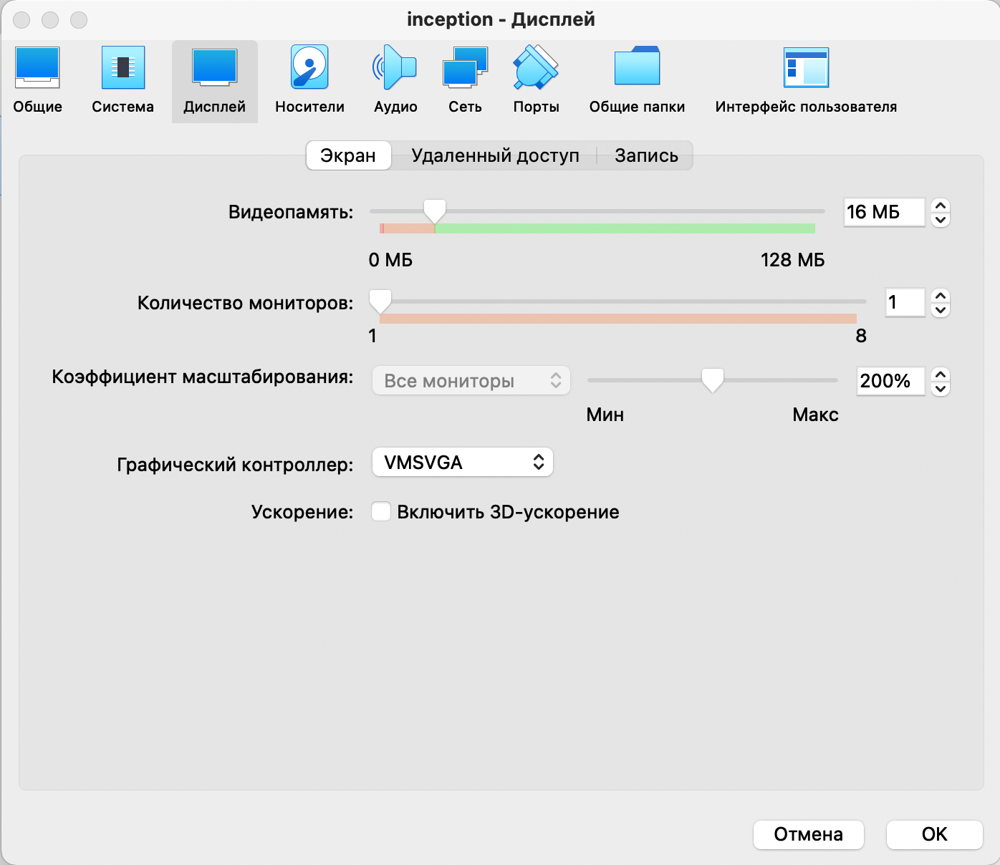
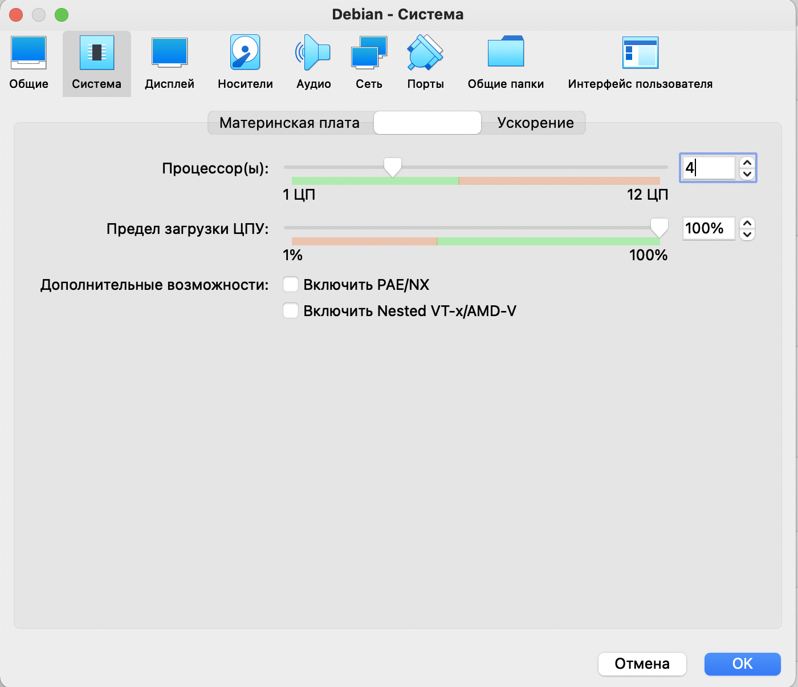
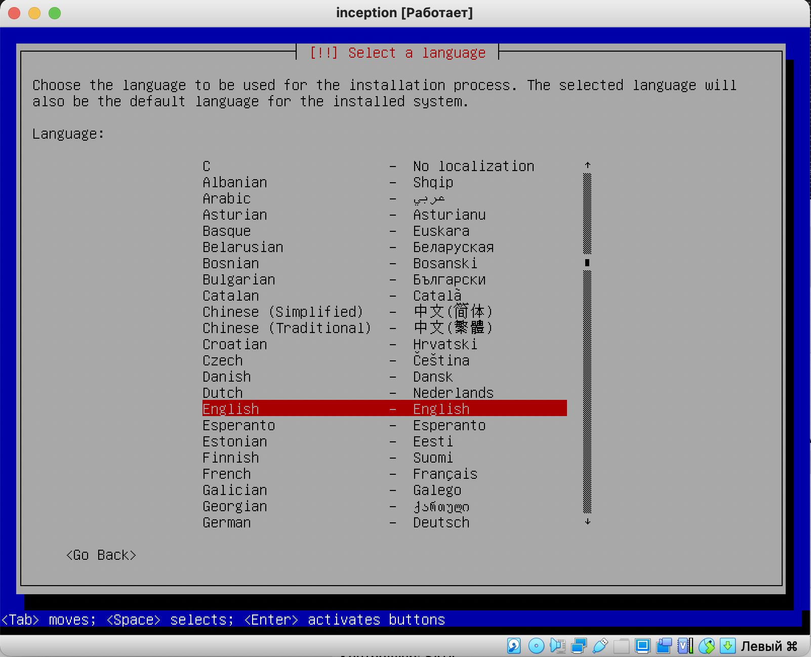
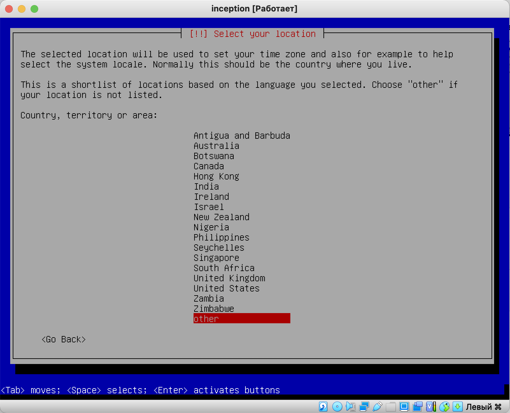
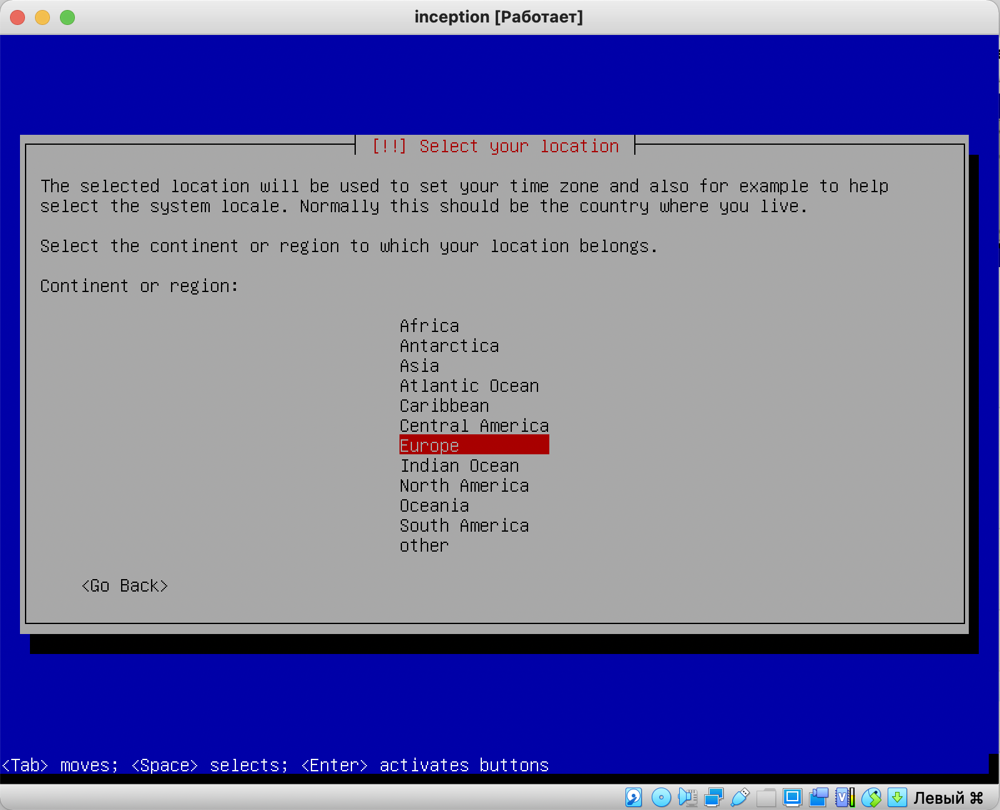
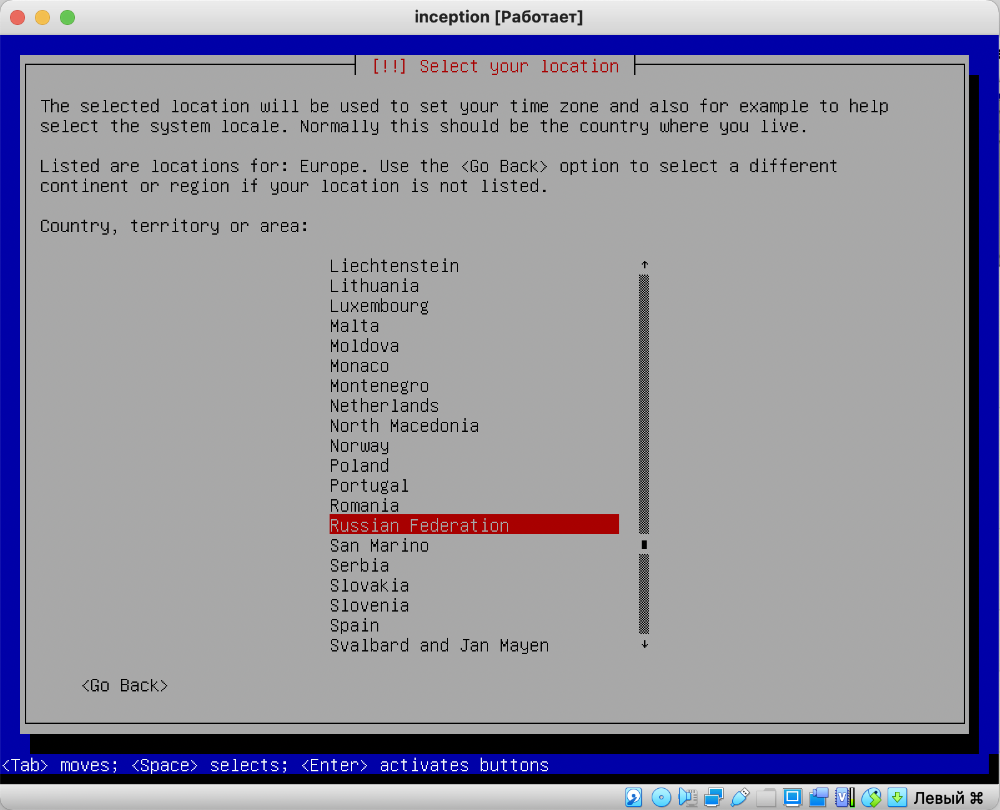
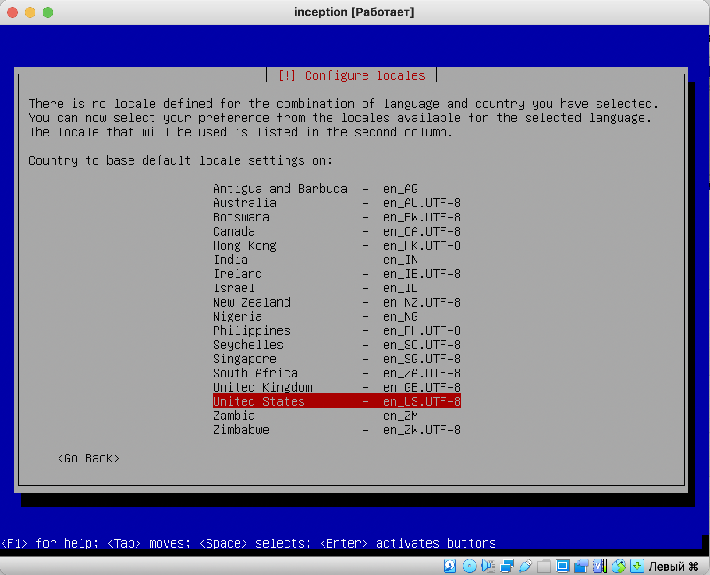

# Установка Debian Linux в Virtualbox

## Шаг 1. Скачивание

Заходим на сайт ```https://www.debian.org/``` и скачиваем веб-инсталлер


## Шаг 2. Запуск

### 2.1 Создание виртуальной машины

Называем как-либо наш проект и 


Создаём виртуальную машину. Оперативной памяти под проект можно выделить от 512 МБ если на ПК 4-8 ГБ до 4096 МБ если на ПК от 16 и выше. Больше 4 ГБ памяти на данный проект выделять бессмысленно.


### 2.2 Выделение ресурсов

Можно выделить от 512 МБ оперативной памяти и не более 8 ГБ дискового пространства. На самом деле система займёт гораздо меньше.

Так же не забудьте выставить удобное разрешение экрана (коэффициент масштабирования), если работаете на mac.

В моём случае мне подошёл коэффициент 200%:


### 2.3 Выделение ресурсов процессора

Так же можно добавить системе ещё одно ядро процессора (больше не обязательно):


## Шаг 3. Установка

### 3.1 Начало установки

После запуска загрузится приветственное окно. Вводим имя пользователя ```roor``` и нажимаем ```enter```


Далее выполняем команду:

```setup-alpnie```



Таким образом мы запускаем процесс установки.

### 3.2 Раскладка клавиатуры

Выбираем английскую раскладку, так как в проекте нам не понадобятся другие языки:



Выбираем метод ввода. Если привычна клавиатура мака, выбираем раскладку us-mac:


### 3.3 Имя хоста

Можно оставить имя хоста по умолчанию, а можно ввести что-либо. Например, свой ник:



Далее трижды нажимаем ```enter```, оставляя по умолчанию настройки сети.

После вводим пароль пользователя. Рекомендую вводить что-то простое, например единицу.

Далее принимаем дефолтные настройки, нажмая ```enter``` до момента выбора логина ssh.

### 3.4 Пользователь ssh

Так как мы не создали дополнительного пользователя и работаем под root-ом, необходимо дать ему права доступа под ssh. Для этого выбираем ```yes``` в ```Allow root ssh login?```:



### 3.5 Установка системы на диск

Далее жмём ```enter``` пока не появится раздел выбора диска. Выбираем единственный доступный вариант - ```sda```:



Далее нам надо выбрать для чего будет использоваться этот диск. Так как это системный диск, то выбираем ```sys```:



Отвечаем утвердительно на предложение стереть диск и продолжить установку:



После система быстро установится и попросит перезагрузки. Перезагрузим виртуальную машину командой ```reboot```:


