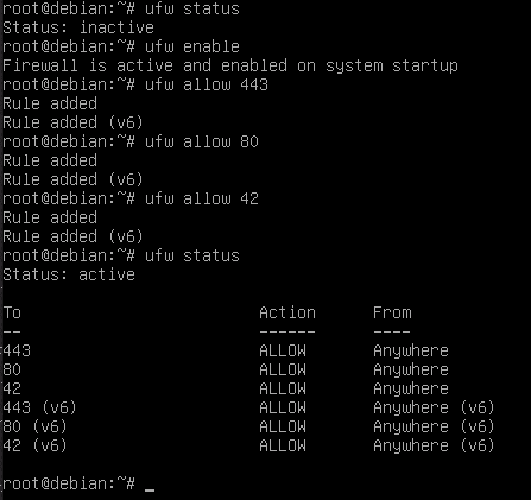

# Проброс портов в виртуальной системе

## Шаг 1. Настройка конфигурации ssh

Логинимся под суперпользователем и открываем файл ```/etc/ssh/sshd_config```


Всё, что происходит далее - это небезопасные настройки для виртуальной гостевой системы, не повторяйте на vps-серверах!

Меняем порт на 42-й (на школьном маке, например, 22-й уже занят ssh хостовой машины и подключиться по нему не получится) и разрешаем логиниться под суперпользователем 


Отключаем вход по ключу (в целом необязательно, но я сделал) и подтверждаем вход по паролю:


После этого сохраняем конфигурацию и перезапускаем сервисы ssh и sshd (вообще достаточно sshd, но привычка делать для верности оба):


## Шаг 2. Настройка файервола

На шаге ```установка системы``` мы уже установили файервол ufw (точнее, ufw это надстройка над файерволом iptables, но в рамках нашей задачи мы не будем углубляться в эти технологии).

Далее нам нужно открыть в файерволе наш порт 42 для ssh, а так же порты 80 и 443 для веб-сайта.

Сначала запускаем наш файервол командой ```ufw enable```, затем разрешаем каждый порт диективой ```ufw allow N```, где N - номер порта:

Открытые порты можно посмотреть при помощи команды ```ufw status```



У меня уже был открыт 22-й порт ранее.

На этом настройки в системе закончены, необходимо выключить виртуальную машину командой ```shutdown now```

Команда ```shutdown``` выключит сервер через минуту, поэтому используем именно ```shutdown now``` для мгновенного завершения:


## Шаг 3. Проброс портов

Мало открыть порты на гостевой машине, нужно ещё и перенаправить траффик с хостовой на гостевую. Траффик, идущий по определённым портам, необходимо перенаправлять путём проброса портов из гостевой машины в хостовую.

В Virtualbox заходим в настройки -> сеть -> дополнительно -> проброс портов, и прописываем следующие правила:


## Шаг 4. Вход через терминал хостовой ОС

После того, как мы пробросили порты, необходимо снова запустить виртуальную машину.

Логиниться не нужно, можно свернуть окно виртуальной машины и войти на наш сервер через терминал.

Для входа под суперпользователем:

```ssh root@localhost -p 42```

Для входа под обычным пользователем:

```ssh user@localhost -p 42```

Нажимаем yes чтобы принять настройки в known_hosts, вводим наш пароль и вуаля - мы на гостевой машине!


Поздравляю, теперь мы можем копипастить команды в терминал, и они будут выполняться на нашем виртуальном сервере!